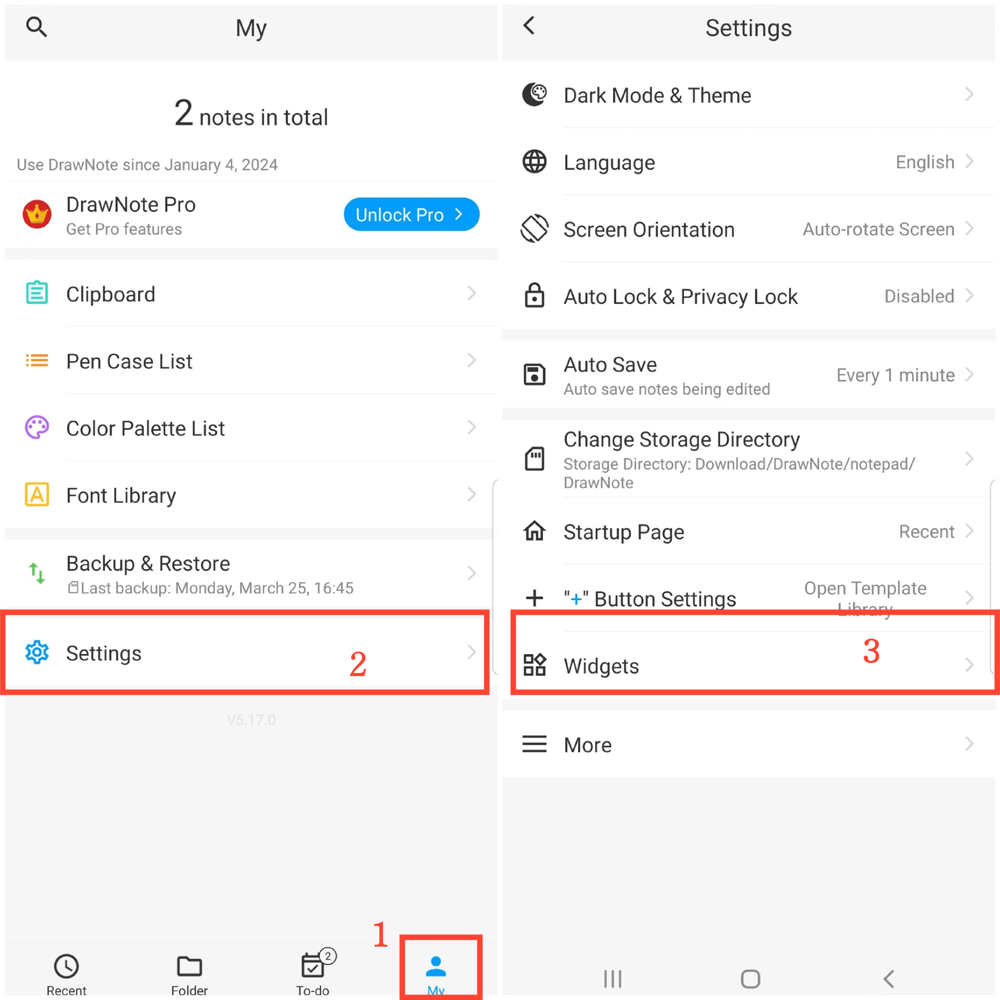

[用户手册](/dragonnest/drawnote/manual/zh) > [更多](/dragonnest/drawnote/manual/en/more) >

Add Desktop Widget
---
By adding desktop widgets to your device's main screen, you can easily and quickly access note editing functions without opening the application.
### Operational Steps
1. Tap "My" on the main screen.
2. Enter "settings".
3. Click "Widgets" and select the type of widget you want to add.

#### Tips
You can also directly access the widget settings on your device's home screen, find the application, and then add the desktop widget.