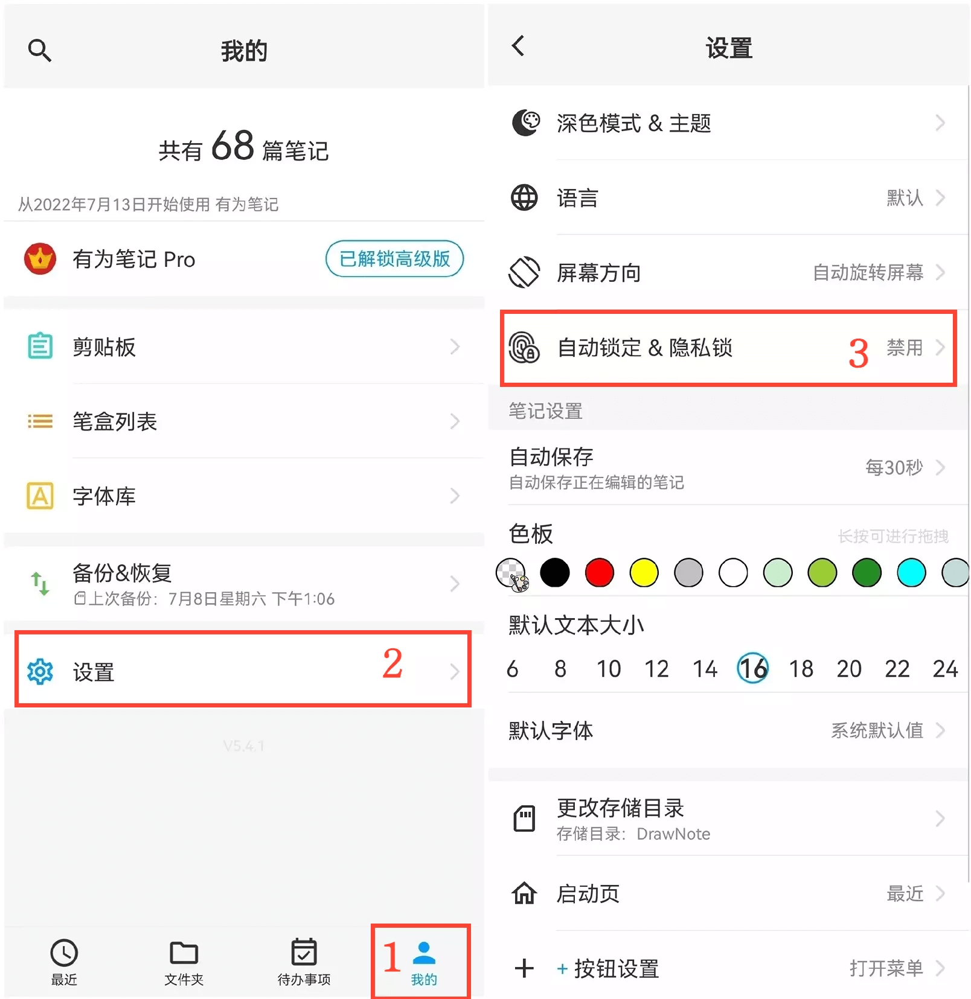
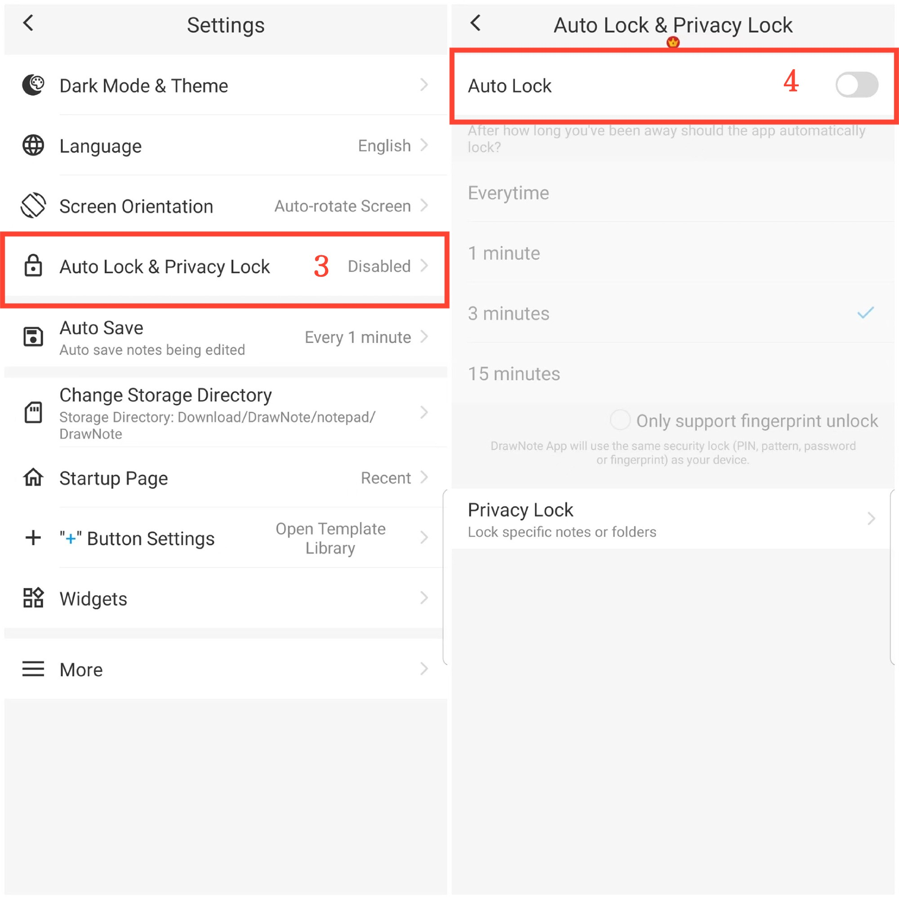

[User Manual](/dragonnest/drawnote/manual/en) > [More](/dragonnest/drawnote/manual/en/more) >

Automatic Lock
---
Automatic lock refers to the application automatically locking after a period of inactivity to enhance privacy and data security, preventing unauthorized access.

#### Operating Steps

1. Tap "My" on the main page.

2. Access settings.

3. Click on "Automatic Lock & Privacy Lock."

4. Turn on the "Automatic Lock" toggle and select the automatic lock time.

