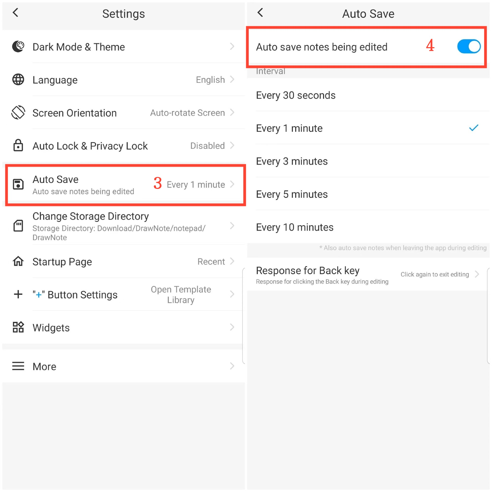

[User Manual](/dragonnest/drawnote/manual/en) > [More](/dragonnest/drawnote/manual/en/more) >

Auto Save
---
Auto save prevents accidental data loss.

#### Steps

1. Tap "My" on the main page.

2. Access settings.

3. Click the "Auto Save" button.

4. Enable the toggle and select the auto-save time.

#### Tips
- Customizable response for clicking the Back key during editing. Response methods include：Cilck again to exit editing, Ask for confirmation,Exit and save.

  