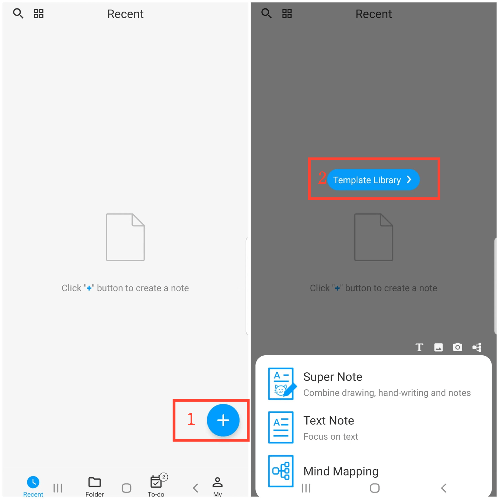
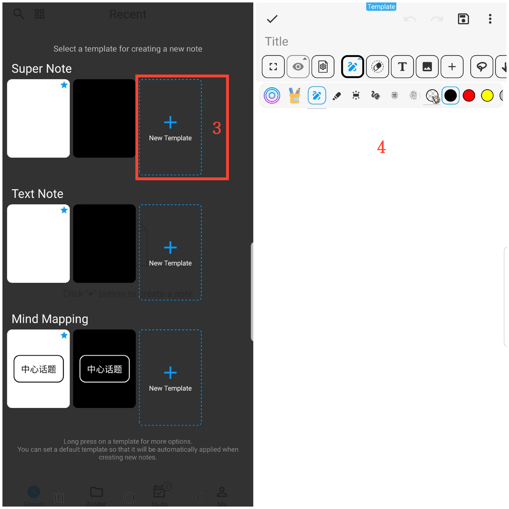

[User Manual](/dragonnest/drawnote/manual/en) > [More](/dragonnest/drawnote/manual/en/more) >

Creating Templates
---
By creating templates, you can automatically apply the configuration of the template when creating a new note, such as background color, font size, font color, and other common settings.

### Steps

1. On the app's homepage, tap the "+" icon in the bottom right corner.
2. Tap "Template Library".
3. Select "New Template" after the desired note type.
4. Enter the template editing page to set up configurations, including background color, font size, font color, etc., and save when finished.

#### Tips
Long press on the template library to access more options, such as view and Edit Template, Set As Default Template, etc.
