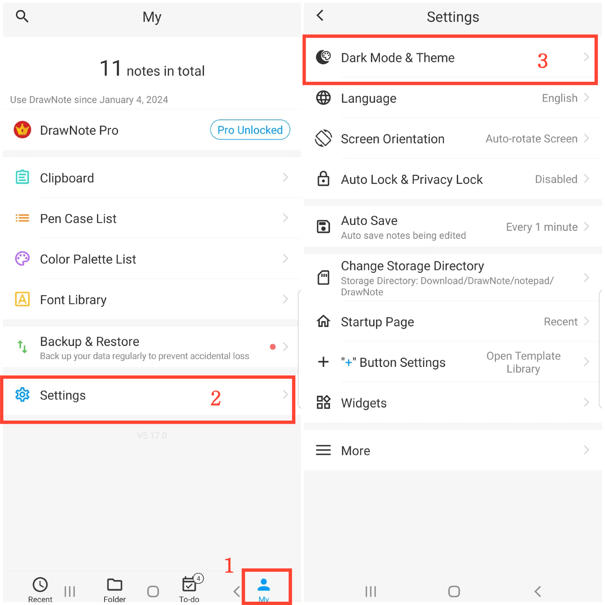

[User Manual](/dragonnest/drawnote/manual/en) > [More](/dragonnest/drawnote/manual/en/more) >

Dark Mode and Theme Switching
---
Dark mode provides a more comfortable reading experience, helping to reduce eye strain and protect visual health. This feature allows you to easily switch to a more comfortable dark mode and choose theme colors according to personal preference.

### Steps
1. Tap on "My" on the main screen.
2. Go to Settings.
3. Click on "Dark Mode & Theme".
4. Here, you can switch to dark mode and choose different theme colors to customize the interface to your liking.

