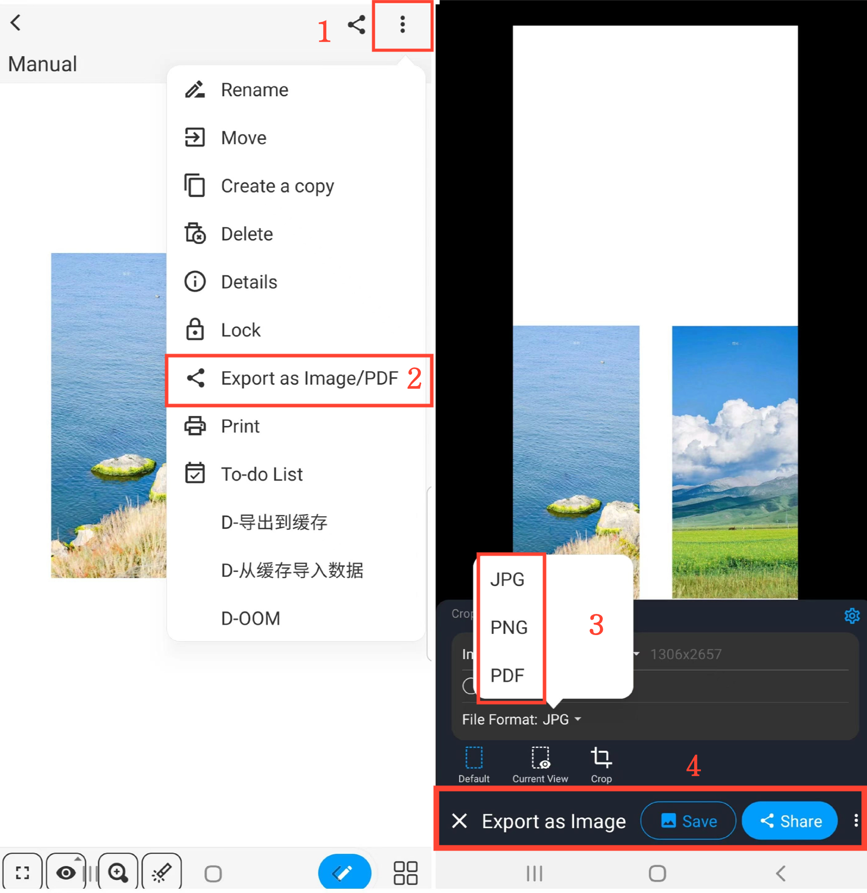

[User Manual](/dragonnest/drawnote/manual/en) > [More](/dragonnest/drawnote/manual/en/more) >

Export/Share Notes
---
There are two methods to export/share notes.

#### Method 1
1. In reading mode, click the "Share" icon in the top right corner of the canvas.

2. Choose the file format you want to export your note in.

3. Select "Save" or "Share" and choose the sharing method to complete the action.

#### Method 2
1. In reading mode, click the "⋮" more icon in the top right corner.

2. Select "Export as Image/PDF."

3. Choose the file format you want to export your note in.

4. Click "Save" or "Share" and choose the sharing method to complete the action.

