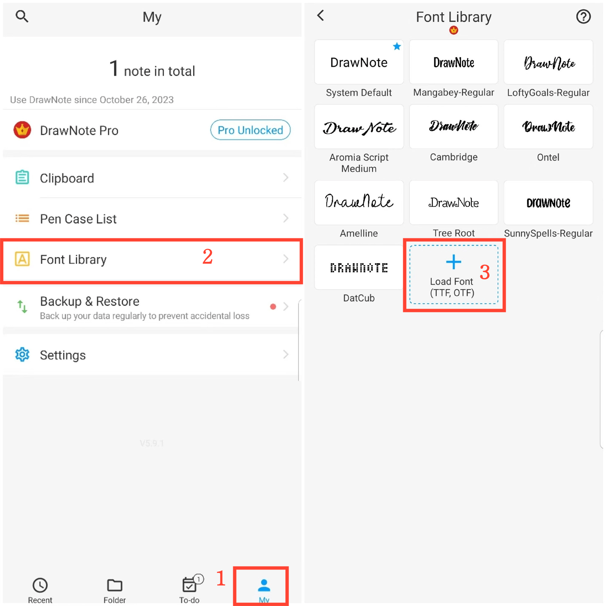

[User Manual](/dragonnest/drawnote/manual/en) > [More](/dragonnest/drawnote/manual/en/more) >

Font Library
---
The font library can save your commonly used fonts. Allow you to freely choose the appropriate font style in text notes or text box.

#### Steps

1. Tap "My" on the main page.

2. Access the font library.

3. Click "Load Font" and select a font file for import.

#### Tips
You can download the fonts you want from this website: https://www.fontspace.com/commercial-fonts