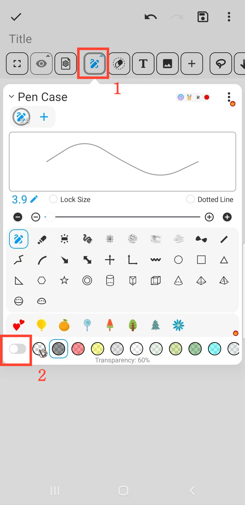

[User Manual](/dragonnest/drawnote/manual/en) > [More](/dragonnest/drawnote/manual/en/more) >

Highlighter Effect
---
The highlighter effect can help you emphasize important information.

#### Operating Steps
1. On the Super Notes page, click the "Pen" button.

2. In the pop-up menu, click the bottom button to change the brush color opacity to achieve the highlighter effect.

