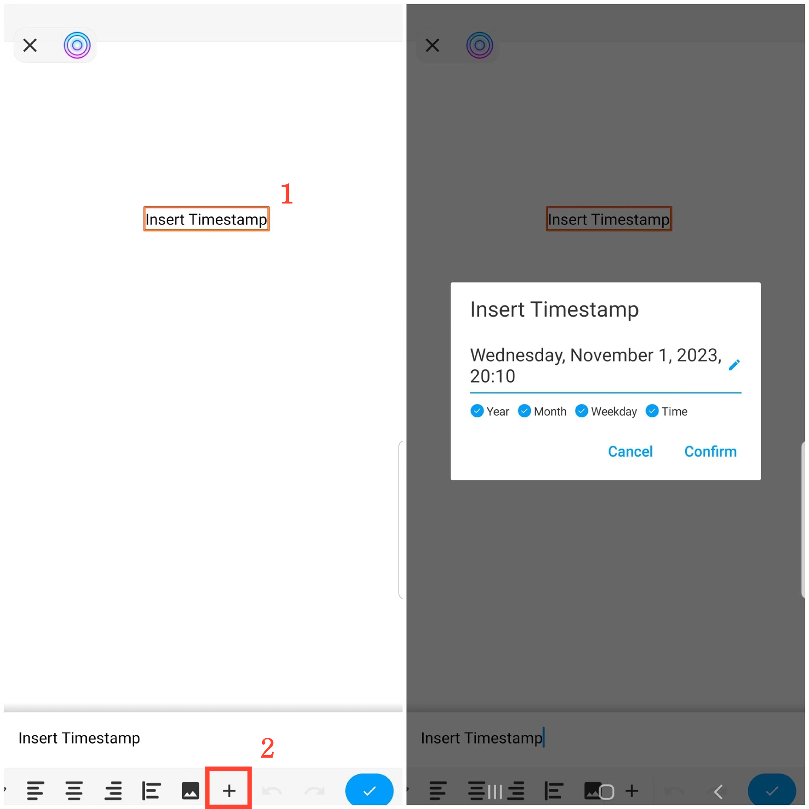

[User Manual](/dragonnest/drawnote/manual/en) > [More](/dragonnest/drawnote/manual/en/more) >

Insert Timestamp
---
Inserting a timestamp makes it easy to record the time of your notes.

#### Steps
In text notes, swipe left and tap the "+" icon, then select "Insert Timestamp" and confirm.

In Super Notes and Mind Mapping, select a text box, open the text menu, swipe left and tap the "+" icon, then choose "Insert Timestamp" and confirm.

