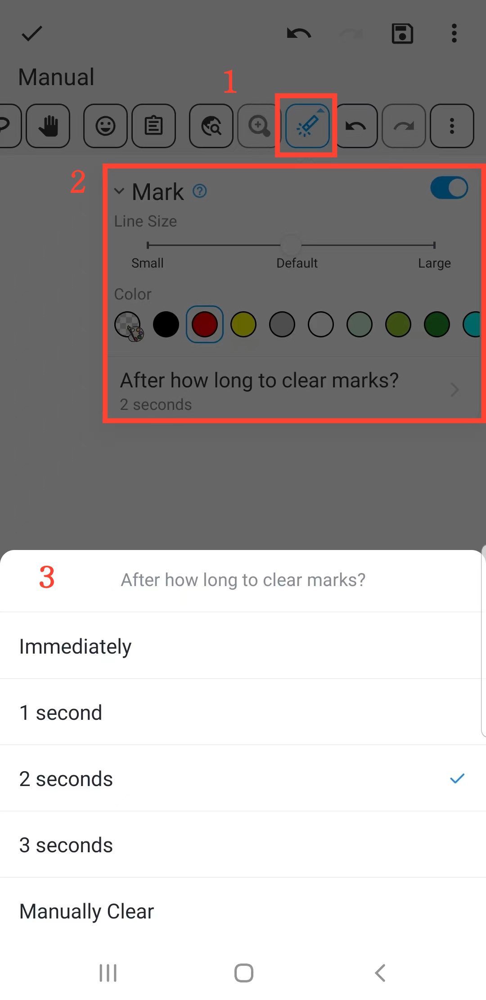

[User Manual](/dragonnest/drawnote/manual/en) > [More](/dragonnest/drawnote/manual/en/more) >

Marking Function
---
The marking function helps you highlight key points and attract attention, suitable for teaching and presentations.

#### Steps

1.Click the "Mark" button in the toolbar to perform marking demonstrations on the canvas.

2.You can adjust the line Size and  colors.

3.Additionally, you can set an automatic clearing time for the markings or manually clear them.

#### Tips
The marking function is for demonstrations, and markings will be deleted when you exit the canvas. If you need to emphasize content and save it permanently, you can enter editing mode and use the pen tool for marking.