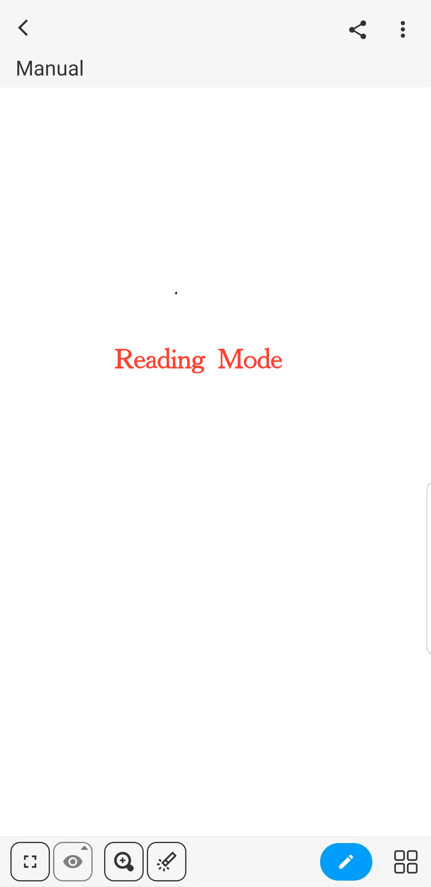
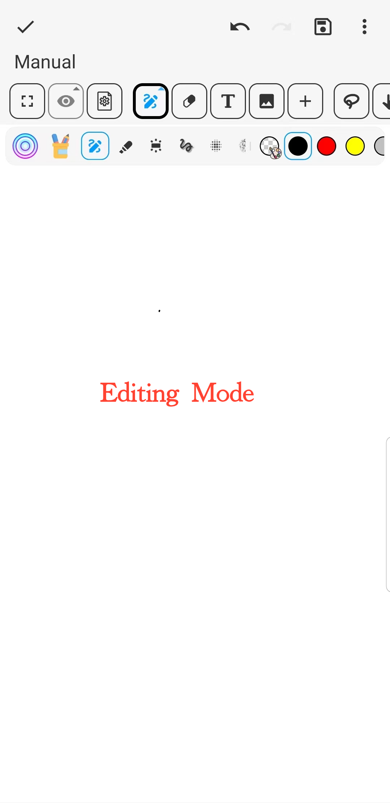

[User Manual](/dragonnest/drawnote/manual/en) > [More](/dragonnest/drawnote/manual/en/more) >

Reading Mode and Editing Mode
---
Reading mode and Editing mode are two states of notes used to view and modify note content.

#### Reading Mode
- Select the note you want to view and click to enter reading mode.

- If you are currently editing a note, click the "√" icon in the upper left corner to switch to reading mode.

#### Editing Mode
- If you are currently reading a note, click the "Pen" icon in the lower right corner to switch to editing mode for note modification and editing.

In reading mode, you can:

- View note content and zoom in or out for information.

- Jump to related notes for more information.

- Click the web link icon to navigate to the related webpage.

- View, save, or share images within the note.

- Click the "⋮" icon in the upper right corner for options like renaming, moving, deleting, exporting, and more.

- Click the toolbar at the bottom for default view switching, marking, zooming, note switching, creating folders, and other operations.