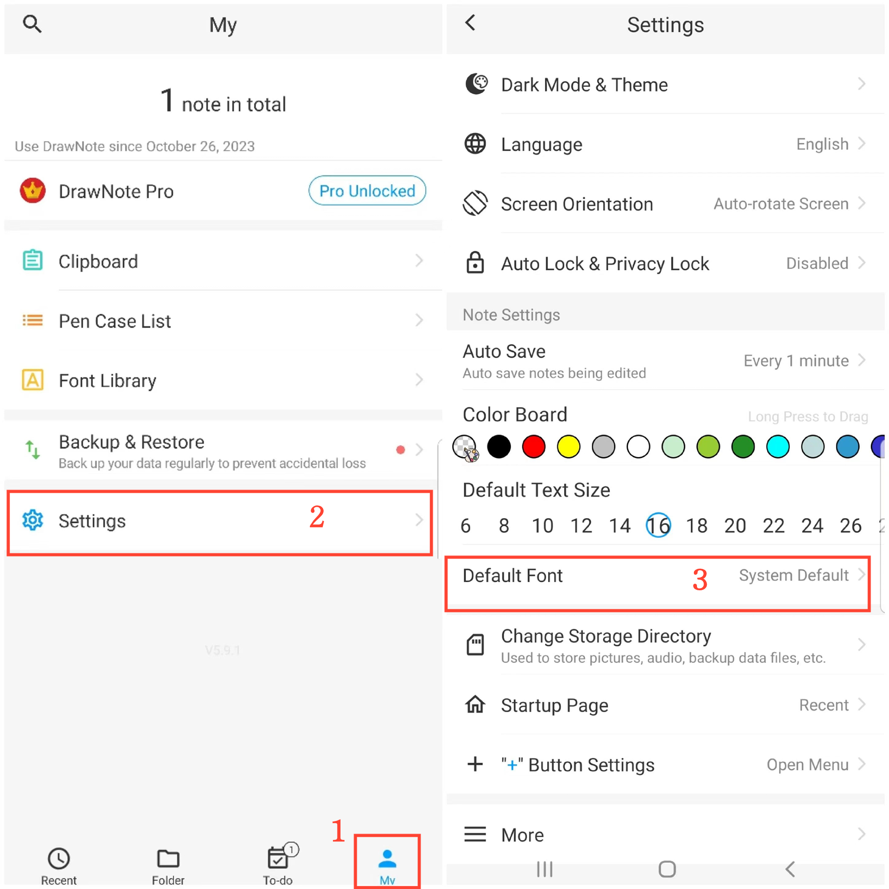

[User Manual](/dragonnest/drawnote/manual/en) > [More](/dragonnest/drawnote/manual/en/more) >

Set Default Font
---
The font library allows you to save commonly used fonts, which you can then select for text in text notes or text editing fields.

#### Adding Fonts
1. Tap "My" on the main page.

2. Access the settings.

3. Click "Default Font."

4. Choose the font you need.

#### Tips
In addition to setting the default font, you can also set the color palette color position and default text size in the settings page.