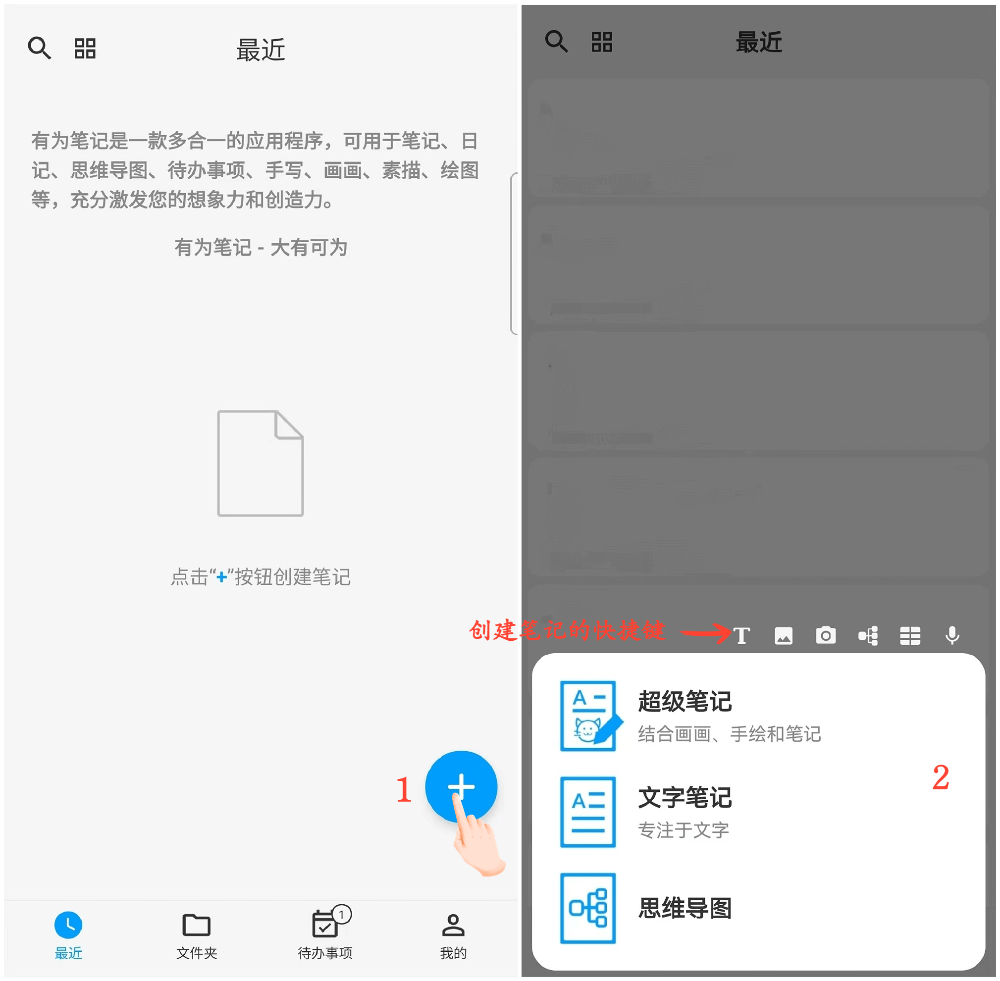

**Creating a New Note**

DrawNote offers various flexible note types to meet different usage scenarios:

- **Super Notes** - Combine elements like handwriting, drawing, text, images, audio recording, tables, mind maps, and more on a flexible canvas to fully express your creativity and artistic talent.

- **Text Notes** - Focus on text records, supporting rich text formatting and the ability to insert images, making your notes more diverse and visual.

- **Mind Mapping** - Help you quickly capture ideas and organize knowledge, presenting complex concepts with clear graphical structures.

**Steps:**

On the application's homepage, click the "+" icon at the bottom right. Choose the type of note you want to create and start your creative process.

**Tips:**

- When creating a new note by clicking the "+" icon in the "Folders" section, the new note will be automatically categorized into the current folder.

- You can also use the quick entry at the top of the menu to quickly enter different functional creative interfaces in Super Notes.