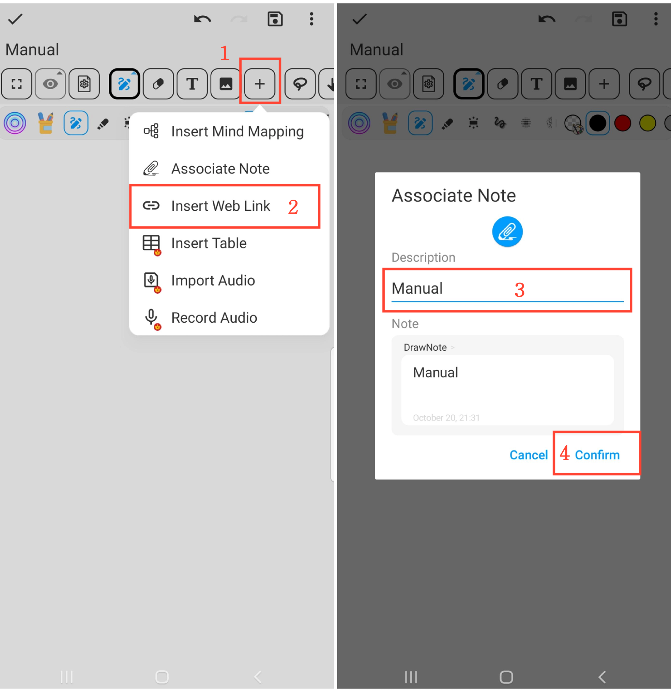

[User Manual](/dragonnest/drawnote/manual/en) > [Super Note](/dragonnest/drawnote/manual/en/super_note) >

Associated Notes
---
The Associated Notes feature allows you to easily connect related notes, improving note organization and search efficiency.
#### Steps

1. Click the "+" button in the toolbar.

2. Click "Associated Notes" and select the notes you want to associate.

3. Optionally, give a name to the associated notes.

4. Click "Confirm" to add the selected notes to the current note.

#### Tips

- Naming associated notes helps with faster retrieval and management.

- Use "Time Order" or "Folders" filters for quicker note selection.