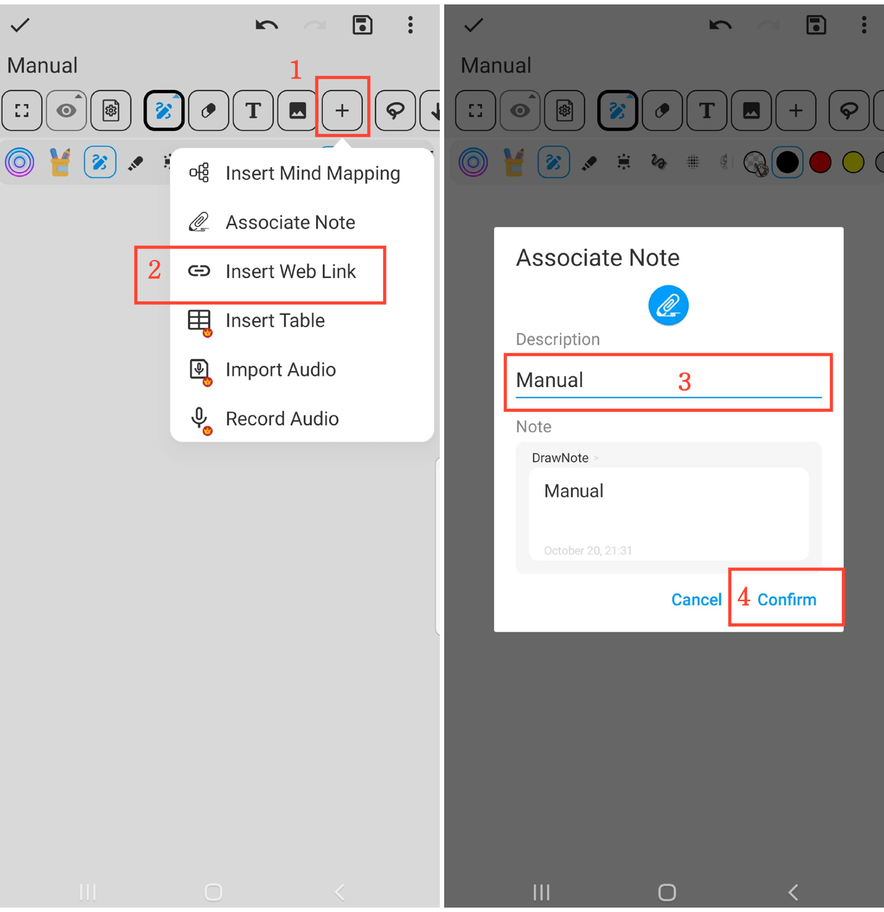

[User Manual](/dragonnest/drawnote/manual/en) > [Super Note](/dragonnest/drawnote/manual/en/super_note) >

Associated Notes
---

The associated notes feature allows you to easily link related notes, enhancing the organization and search efficiency of your notes.

#### Steps

1. Click the "+" button in the toolbar.

2. Click "Associated Notes" and select the note you want to link.

3. Name the associated note (optional).

4. Click "Confirm" to add the linked note to the current note.

#### Tips

- Naming the associated notes helps in quicker search and management.

- Using the "Chronological Order" or "Folder" filter can help in faster note selection.