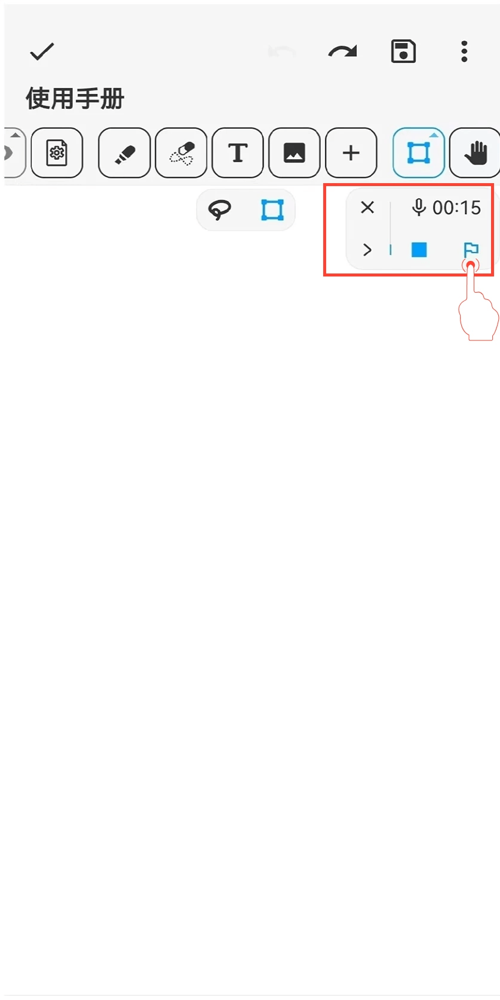

[User Manual](/dragonnest/drawnote/manual/en) > [Super Note](/dragonnest/drawnote/manual/en/super_note) >

Audio Marker
---
The audio marker is similar to a bookmark, helping you quickly locate and replay key sections during audio recording or playback.

#### Steps

During recording or playback, click the "Marker" button to insert a marker at the current time.

#### Tips

1. **Adjust audio speed and add markers** - Easily done in the toolbar.

2. **Edit recording and marker names** - Click the "≡" button on the right, then click the "Pencil" button.

3. **Download audio** - Click the "⋮" button on the left to download.

4. **View audio marker history** - View markers in the expanded menu; click on a marker to quickly jump to and play the audio.

