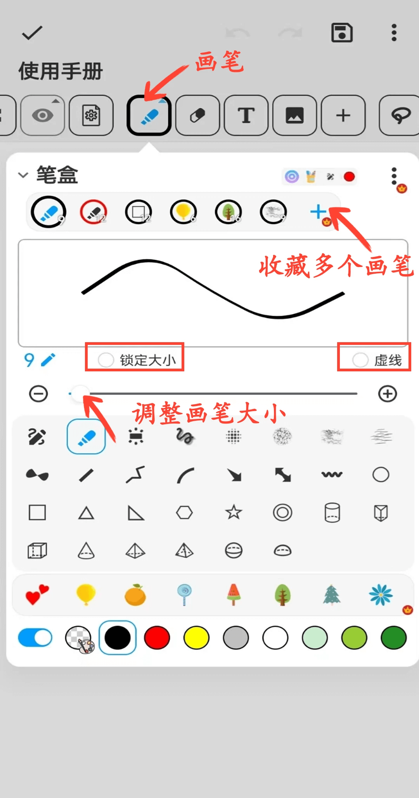
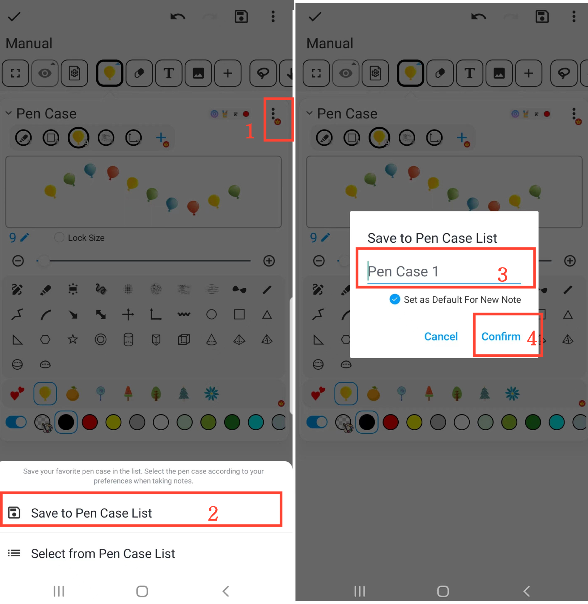
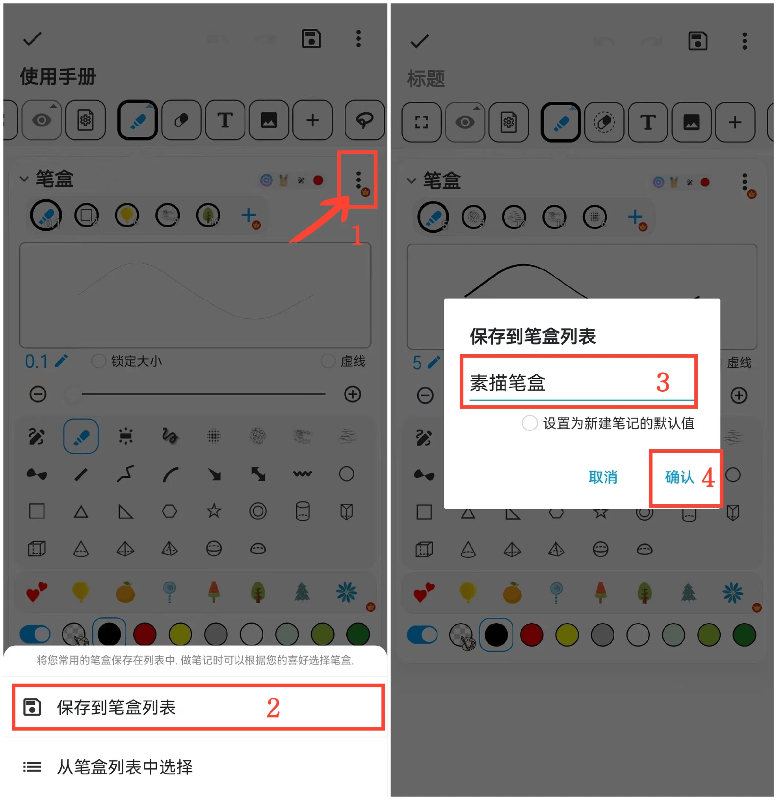
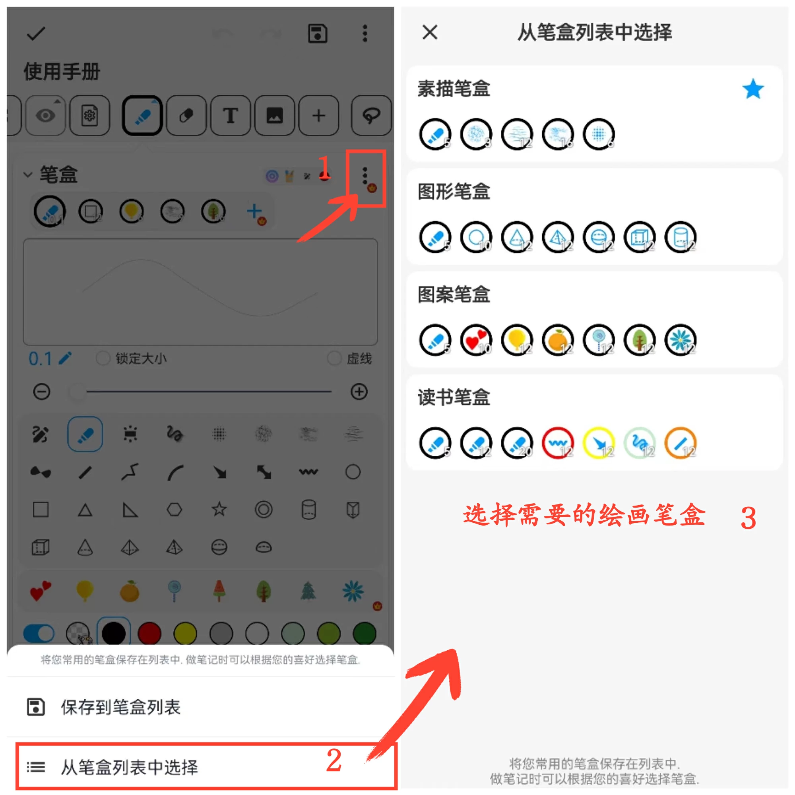

[User Manual](/dragonnest/drawnote/manual/en) > [Super Note](/dragonnest/drawnote/manual/en/super_note) >

Brush Function
---

#### Steps

Click the "Brush" button in the toolbar to perform the following actions.

#### Collect Multiple Brushes

Click the "+ Brushes" button in the brush collection bar to add different types of brushes.

#### Adjust Brush Size

Use the middle slider or the "+" and "-" buttons on either side to adjust the brush size.

#### Lock Brush Size

Check the "Lock Size" button to keep the brush size constant. Even if you zoom in or out on the canvas or page, the brush size remains the same.

#### Dashed Line Effect

Check the "Dashed" button to apply a dashed brush effect.

#### Adjust Brush Position

In the brush collection bar, long-press the brush you want to reposition, then drag it left or right to the desired position and release to complete the adjustment.

#### Delete Collected Brushes

In the brush collection bar, long-press the brush you want to delete, then drag it to the "Trash" icon on the right and release it to delete the brush.

#### Save Common Brush Collections

On the brush collection page, click the "⋮" button in the upper right, select "Save to Brush List." Then, name the brush collection and confirm to save your common brush collection.

#### Select Common Brush Collections

On the brush collection page, click the "⋮" button in the upper right, and then choose the brush collection you need from the brush list.

