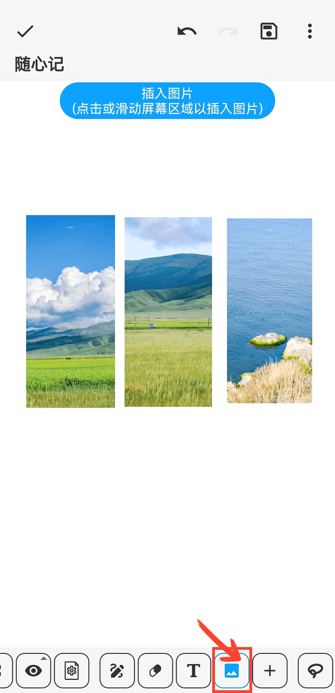
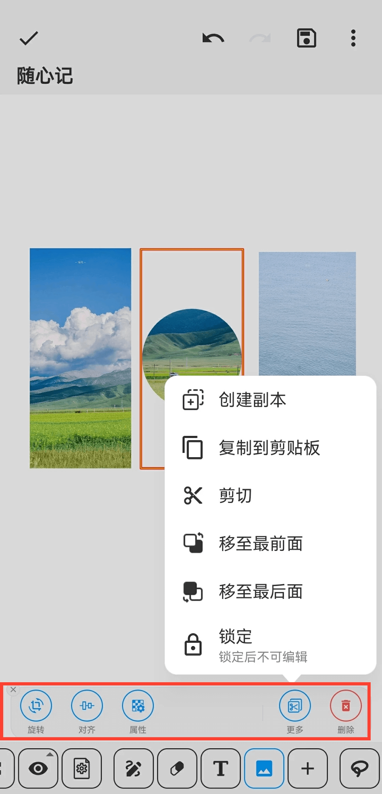

[User Manual](/dragonnest/drawnote/manual/en) > [Super Note](/dragonnest/drawnote/manual/en/super_note) >

Insert Picture
---
#### Steps

1. Click the "Picture" button in the toolbar.

2. By clicking or sliding on the screen area, you can insert a picture at the desired location.

#### Tips
- After selecting a picture, the bottom toolbar provides editing options, such as rotation, shape, and transparency.
- You can combine the text feature to annotate the contents of the picture for a more detailed and accurate expression.
- Click on the picture to resize it.

