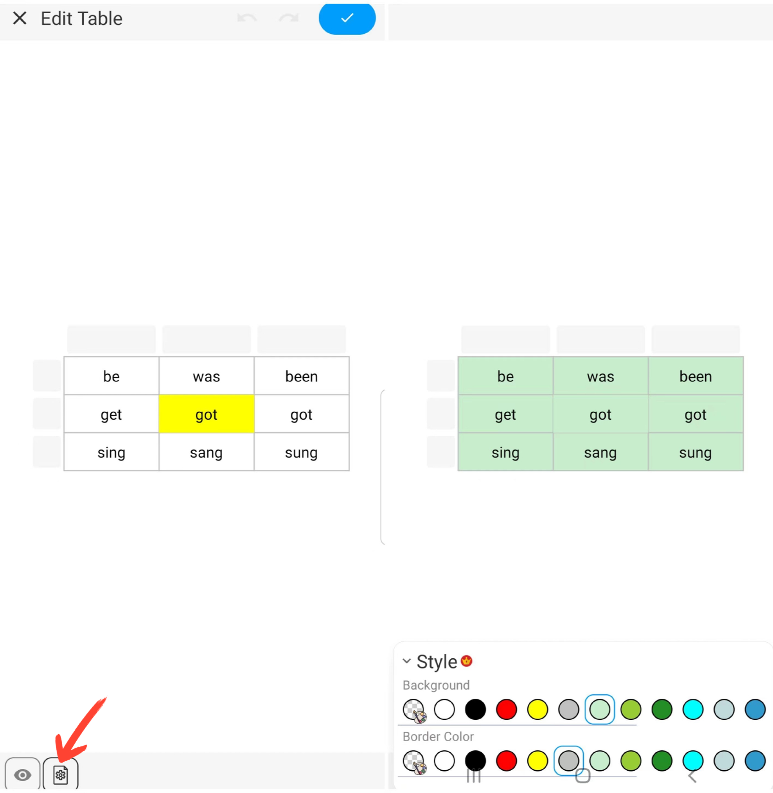

**Insert a Table**

- **Operation Steps**

    1. Click the "+" button in the toolbar.

    2. Choose "Insert Table" to add a table to your notes.

  

- **Tips**
    - Set the number of cells - Slide or input a number to select the desired number of cells.
    - Adjust table width and height - Slide the size slider or input numbers to set the default size of cells.

  

    - Edit cell format - After selecting a cell, you can set its size, color, and clear its content.
    - Edit cell text format - After selecting a cell, you can edit text content and format, including color, font size, bold, underline, and alignment.

  

    - Set the format for an entire row or column - After selecting a row or column, you can perform operations such as merging cells, setting background colors, and clearing content.

    - Insert an entire row or column - After selecting a row or column, click the "Insert" button to add new rows or columns.

  

    - Customize the table's appearance - Click the "Settings" button in the bottom left corner of the canvas and set the table's background color and border color.

  