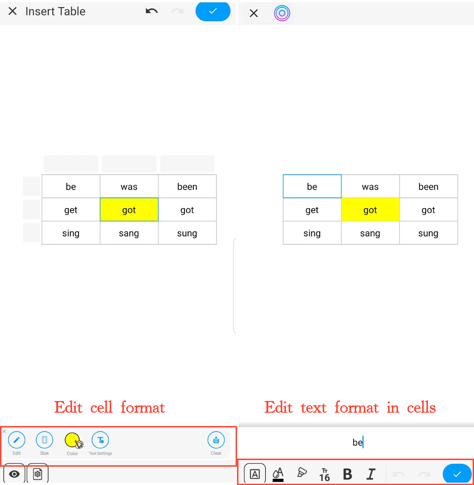

[User Manual](/dragonnest/drawnote/manual/en) > [Super Note](/dragonnest/drawnote/manual/en/super_note) >

Insert Table
---
#### Steps

1. Click the "+" button in the toolbar.

2. Choose "Insert Table" to add a table to your notes.

#### Tips
- Set the number of cells - Slide or input numbers to choose the required number of cells.

- Adjust table width and height - Slide the size slider or input numbers to set the default cell size.

- Edit cell format - Once a cell is selected, you can set its size, color, and clear its content.

- Edit text format in cells - Once a cell is selected, you can edit its text content and format, including color, font size, bold, underline, and alignment.

- Set the format for an entire row or column - Once a row or column is selected, you can merge cells, set the background color, clear content, and more.

- Insert a whole row or column - Once a row or column is selected, click the "Insert" button to add a new row or column.

- Set table appearance - Click the "Settings" button at the bottom left of the canvas, and in the menu, set the table's background and border color.

