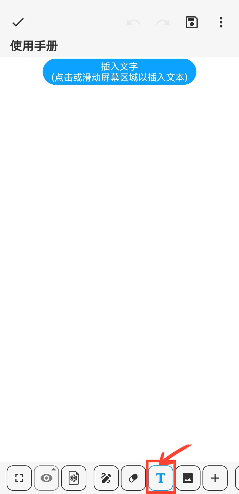
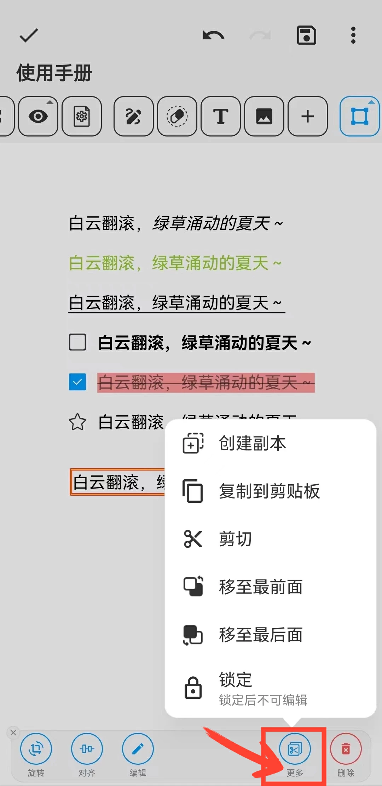
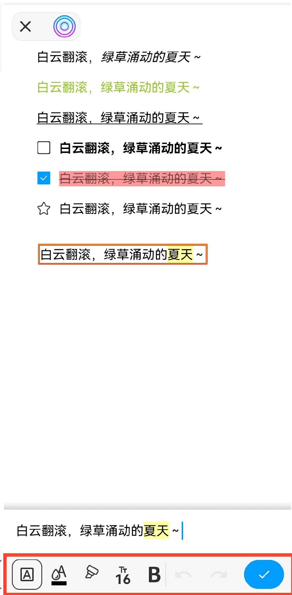

[User Manual](/dragonnest/drawnote/manual/en) > [Super Note](/dragonnest/drawnote/manual/en/super_note) >

Insert Text
---
#### Steps

1. Click the "T" button in the toolbar.

2. Tap or swipe on the screen area to insert text at the desired location.

#### Tips
- Once the text box is selected, you can rotate, align, edit, and more. By clicking on “More”, you can also create a duplicate, copy, cut, and lock the text box.

  

- In the text editing box, once the text is selected, you can set its format, including color, size, bold, underline, and more.

