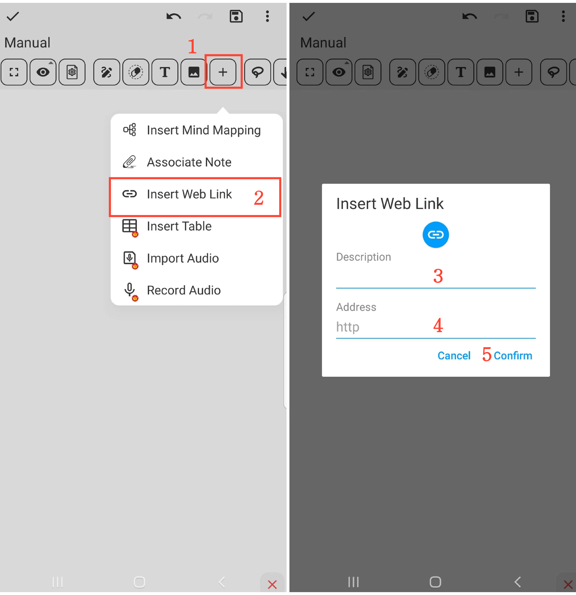

**Insert Web Link**

- **Operation Steps**

    1. Click the "+" button in the toolbar.

    2. Choose the "Insert Web Link" option.

    3. Fill in the link name (optional).

    4. Enter or paste the web link.

    5. After confirming the operation, the link will be inserted.

  

- **Tips**

    - Give the link a descriptive name for easy future reference and location.

    - In reading mode, you can directly access the webpage by clicking the link icon.