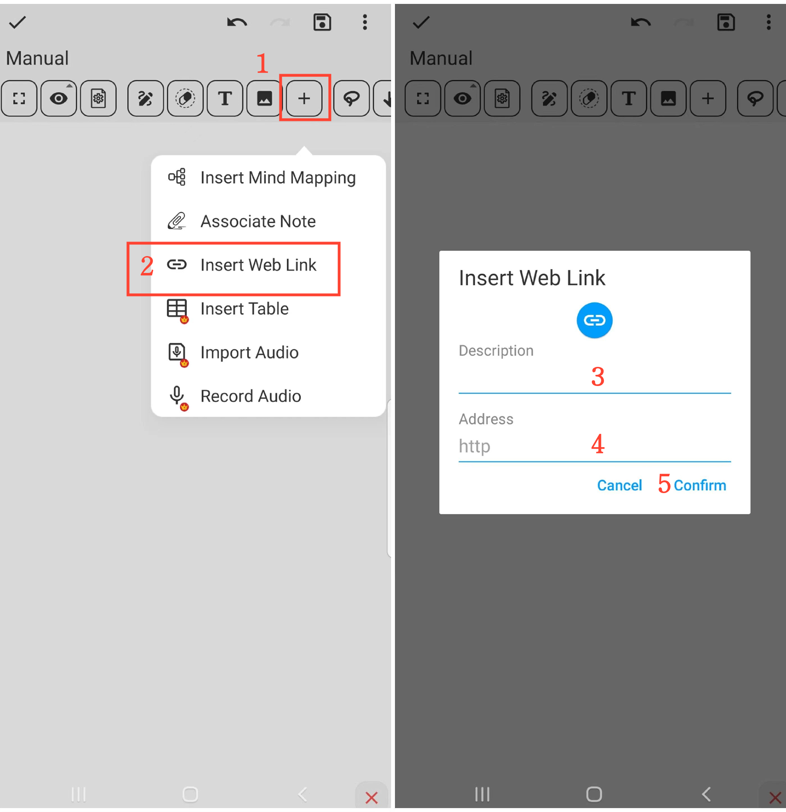

[User Manual](/dragonnest/drawnote/manual/en) > [Super Note](/dragonnest/drawnote/manual/en/super_note) >

Insert Web Link
---
#### Steps

1. Click on the "+" button in the toolbar.

2. Choose the "Insert Web Link" option.

3. Fill in the link name (optional).

4. Type or paste the web link.

5. Confirm the operation to insert the link.

#### Tips
- Give the link a descriptive name to make it easier to find and locate later.

- In reading mode, click on the link icon to directly access the web page.