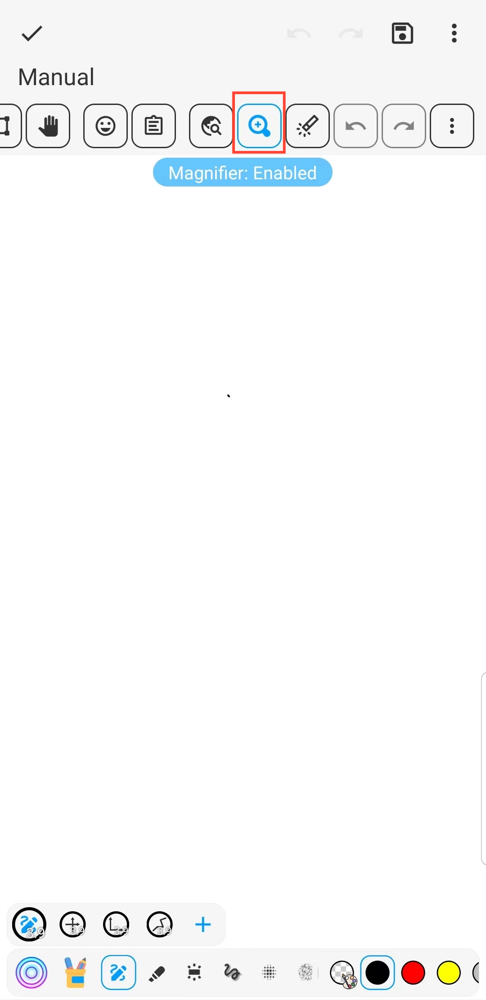

[用户手册](/dragonnest/drawnote/manual/en) > [超级笔记](/dragonnest/drawnote/manual/zh/super_note) >

Magnifier
---
The magnifying glass function can help you view and edit note content more conveniently. Especially when working with small fonts or detailed graphics. It can enlarge text and pictures and provide accurate positioning and convenient operation.
#### Steps

On the Super Notes page, click the Magnifier glass button on the toolbar.

