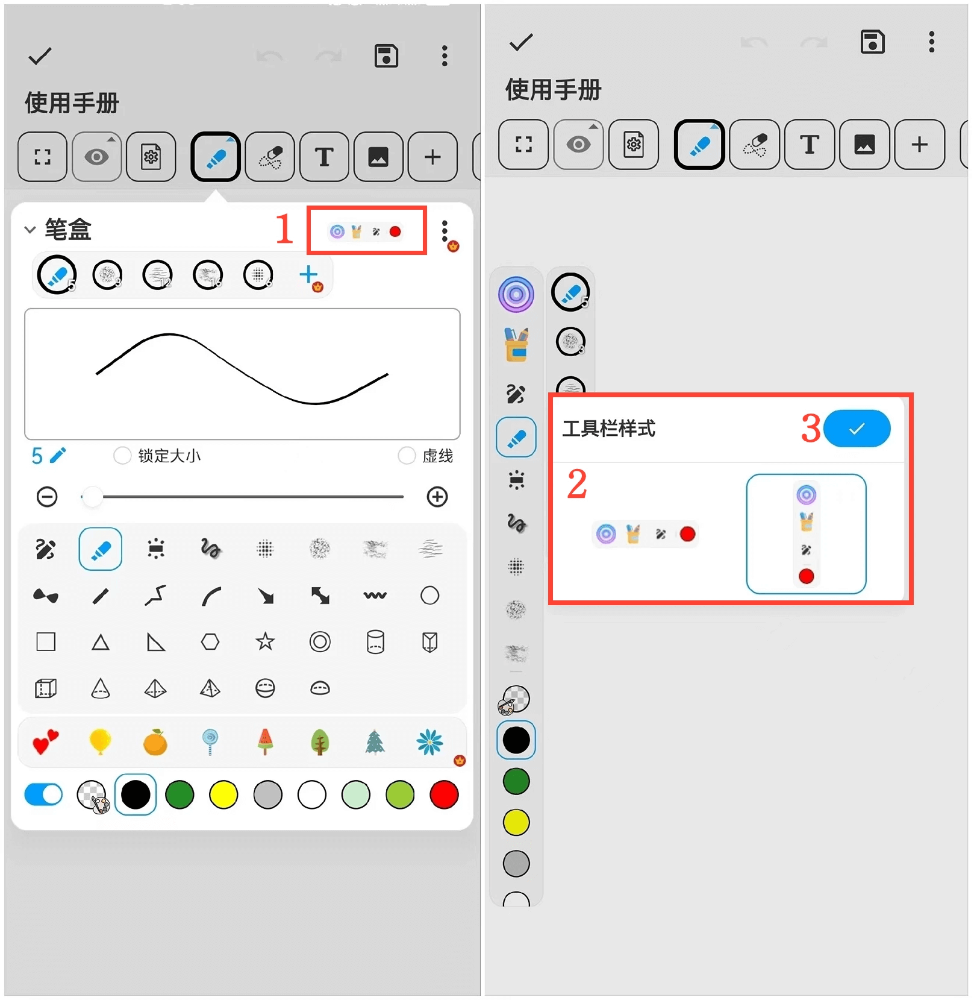
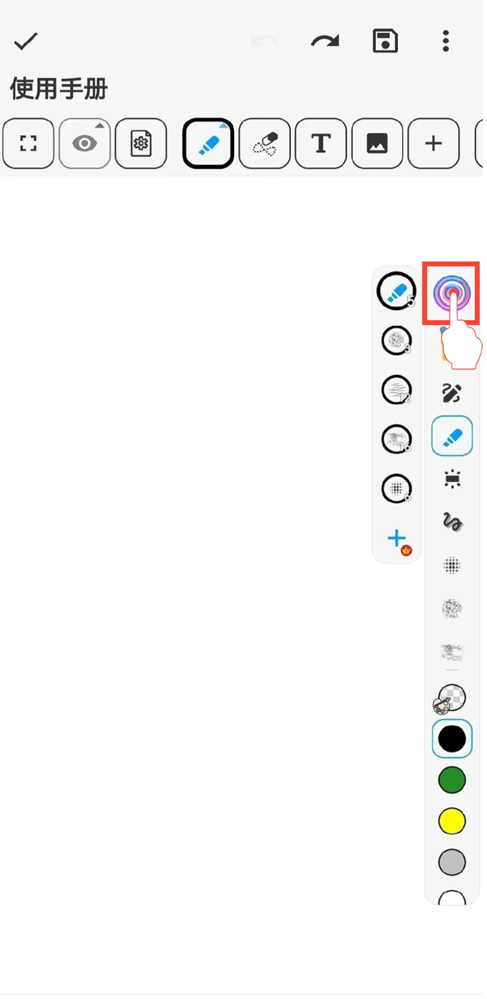

[User Manual](/dragonnest/drawnote/manual/en) > [Super Note](/dragonnest/drawnote/manual/en/super_note) >

Move Pencil Toolbar
---

You can adjust the pencil toolbar's horizontal or vertical position on the canvas, allowing for easy up-down or left-right movement.

#### Steps

1. In the pencil box page, select "Toolbar Style".

2. Choose horizontal or vertical alignment.

3. Check to confirm.

#### Tips
- Hold the circular button on the pencil toolbar to drag and adjust its position.

