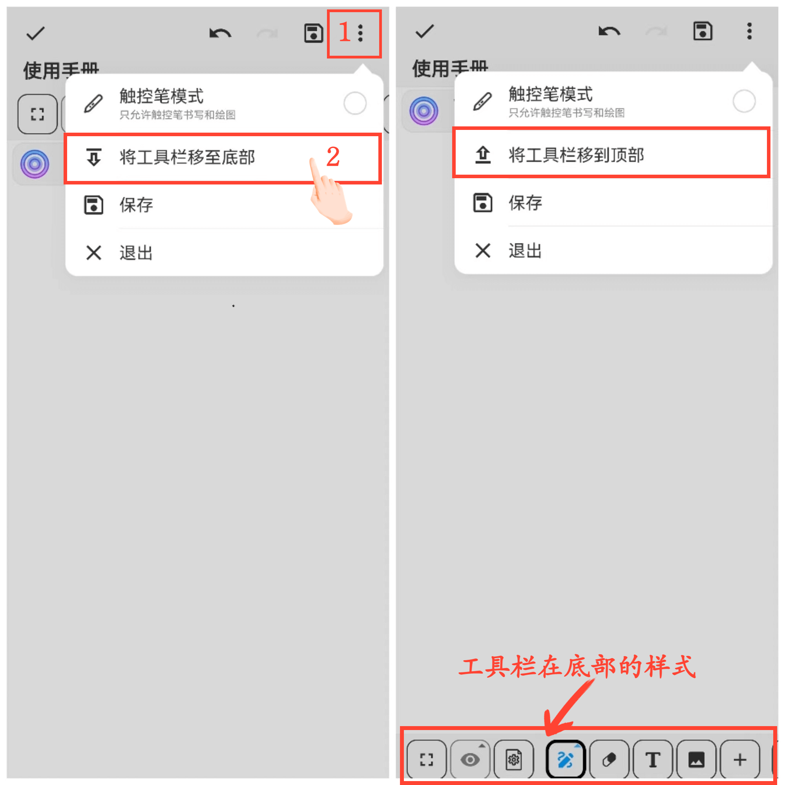

**Move Toolbar**

You can adjust the position of the toolbar on the canvas to either the bottom or top.

**Operation Steps:**

1. Click the "⋮" button in the top right corner of the canvas.

2. Choose the toolbar position: "Move the toolbar to the bottom" or "Move the toolbar to the top."

   