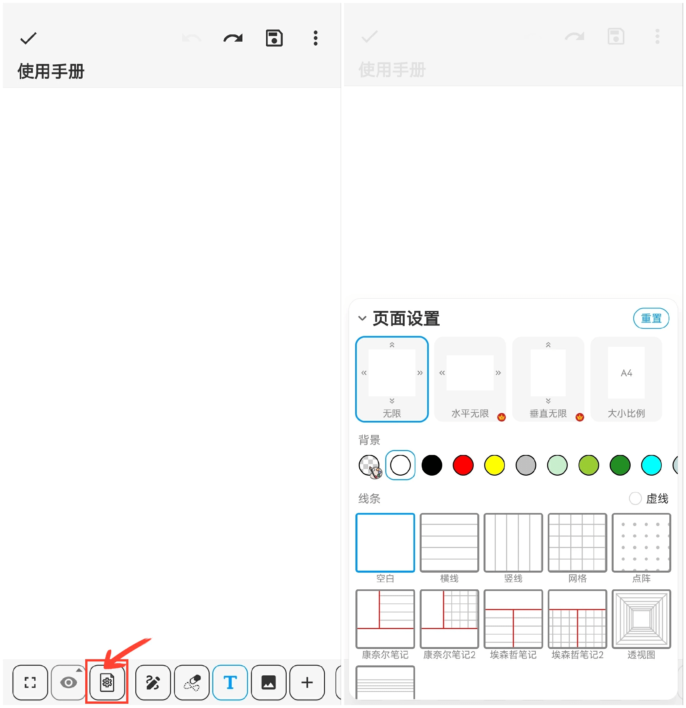

**Page Settings**

You can configure the canvas orientation, dimensions, background color, and note lines.

**Operation Steps:**

Click the "Page Settings" button in the toolbar.

**Infinite Canvas**

We provide three types of infinite canvas directions: Infinite, Horizontal Infinite, and Vertical Infinite to meet different needs and preferences.

- Infinite: It stretches infinitely in both horizontal and vertical directions, with a zoom range of 0.02x to 200x.
- Horizontal Infinite: It stretches infinitely in the horizontal direction, with a zoom range of 0.2x to 1x.
- Vertical Infinite: It stretches infinitely in the vertical direction, with a zoom range of 0.2x to 1x.

**Canvas Size**

Click "Size Ratio" to choose standard sizes such as A4 or A3, or customize the size according to your needs.

**Canvas Background and Note Lines**

Adjust the background color, select suitable line styles, and enjoy a variety of note templates to help you better organize and document your content.