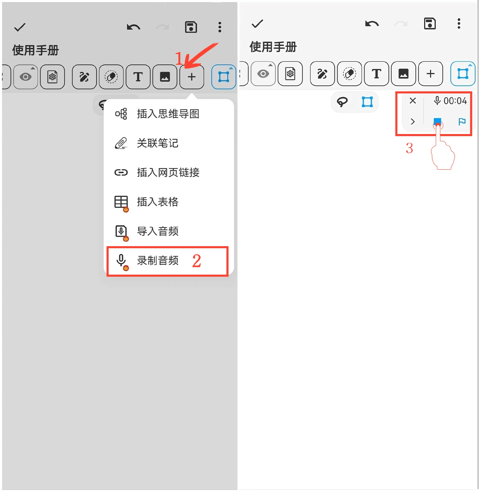

[User Manual](/dragonnest/drawnote/manual/en) > [Super Note](/dragonnest/drawnote/manual/en/super_note) >

Record Audio
---
#### Steps

1. Click on the "+" button in the toolbar.

2. Select the "Record Audio" option to start recording audio.

3. Click the "Stop" button to finish recording.

