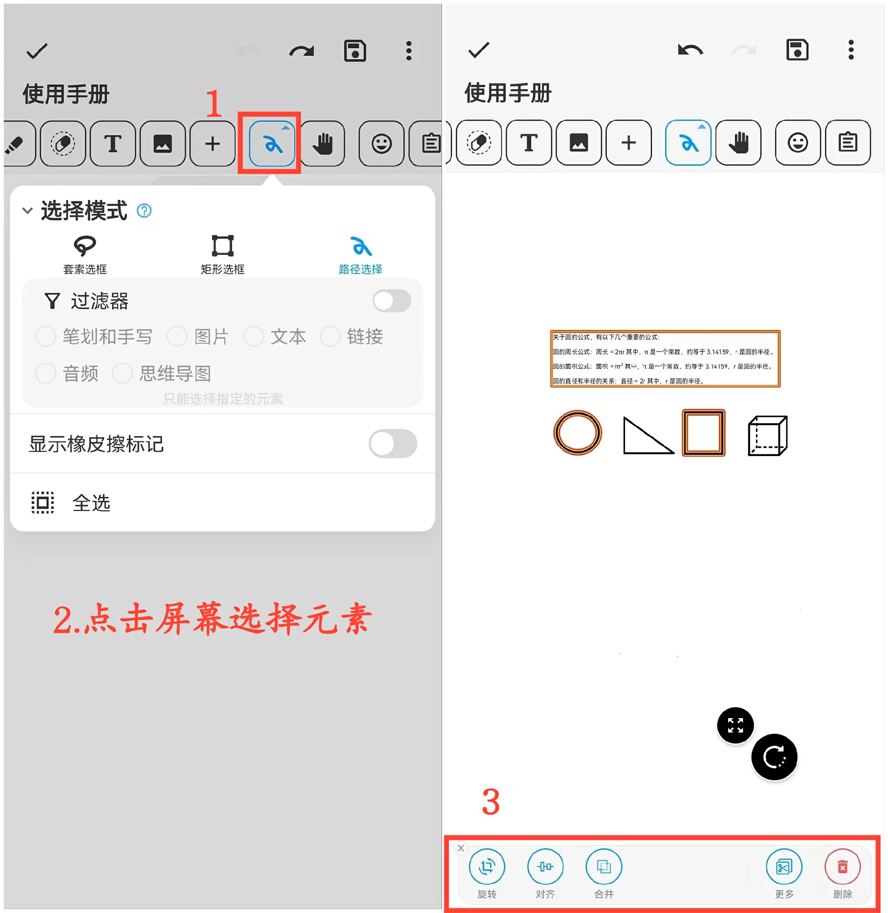

**Select Mode**

Select mode provides various ways to make selections:

- Lasso Selection: Select elements within a closed area formed by the lasso.
- Path Selection: Select elements covered by a path.
- Rectangle Selection: Select elements within a rectangular area.

**Operation Steps:**

1. Click the "Select Mode" button in the toolbar to choose your preferred selection method.

2. Click on the canvas and drag to select the content you want to edit, whether it's a single element or multiple elements.

3. Perform actions like rotating, zooming, resizing, merging, cutting, deleting, and more on the selected elements.

**Tips:**
When dealing with multiple overlapping elements, you can use filters to precisely select specific content, enhancing your management and organization efficiency.