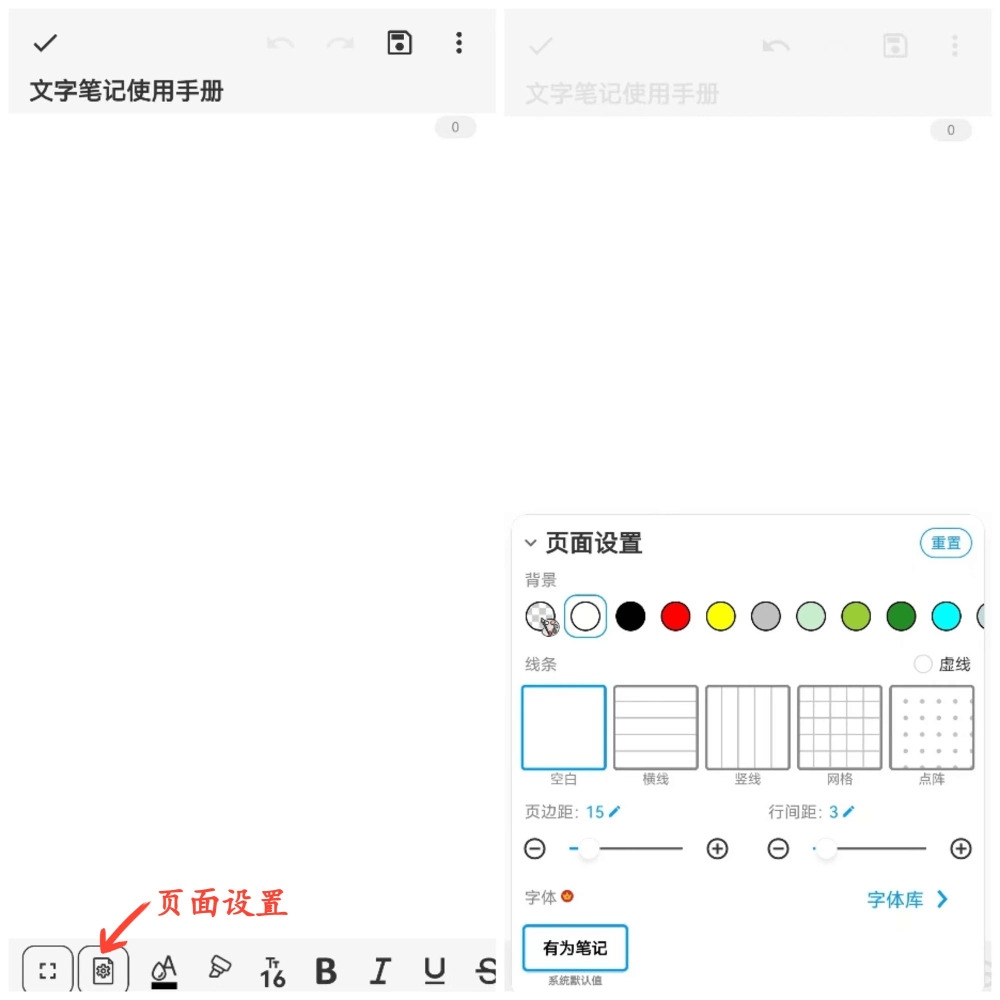

[User Manual](/dragonnest/drawnote/manual/en) > [Text Note](/dragonnest/drawnote/manual/en/text_note) >

**Page Settings**

Here are the steps to configure page settings:

1. Click on the "Page Settings" icon in the toolbar at the bottom of the screen.

2. This will open the Page Settings menu where you can define page background, line styles, line type, font, margins, line spacing, and font style.

