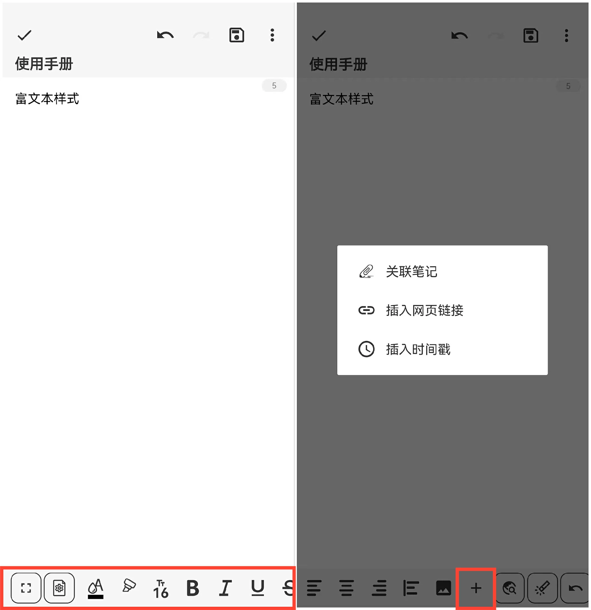

[User Manual](/dragonnest/drawnote/manual/en) > [Text Note](/dragonnest/drawnote/manual/en/text_note) >

Rich Text Style
---
The rich text style feature of the Text Note offers a more diversified text editing experience.

Apart from easily recording text, you can also customize the font color, size, bold, italic, underline, and other styles.

Moreover, we've introduced quick input features such as inserting links, inserting timestamps, and inserting pictures to enhance your editing efficiency.

