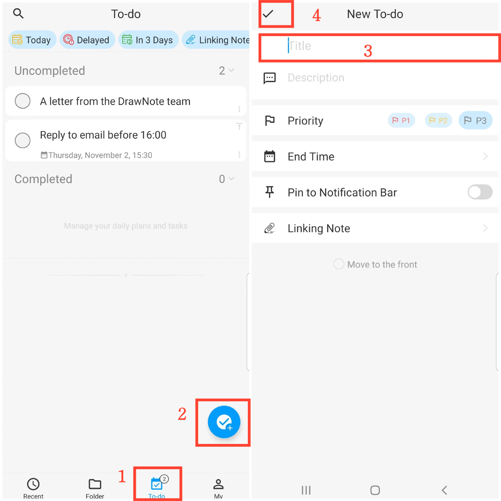

[User Manual](/dragonnest/drawnote/manual/en) > [To-Do List](/dragonnest/drawnote/manual/en/to_do) >

**Create a New To-Do Item**

#### Procedure

1. Navigate to the "To-Do" page.

2. Click the "+" button.

3. Enter a title, description, and other information.

4. Click the confirmation button in the upper left corner to create a new to-do item.

#### Tips

1. To-Do Item Count: The current number of unfinished tasks is displayed in the bottom tab bar.

2. Pin To-Do Items: On the "To-Do" page, click the "Pin" button in the upper right corner of a specific item to move important tasks to the top.

3. Move to the Top: On the "Create a New To-Do Item" page, click the "Move to the Top" button at the bottom to place the task at the top.

