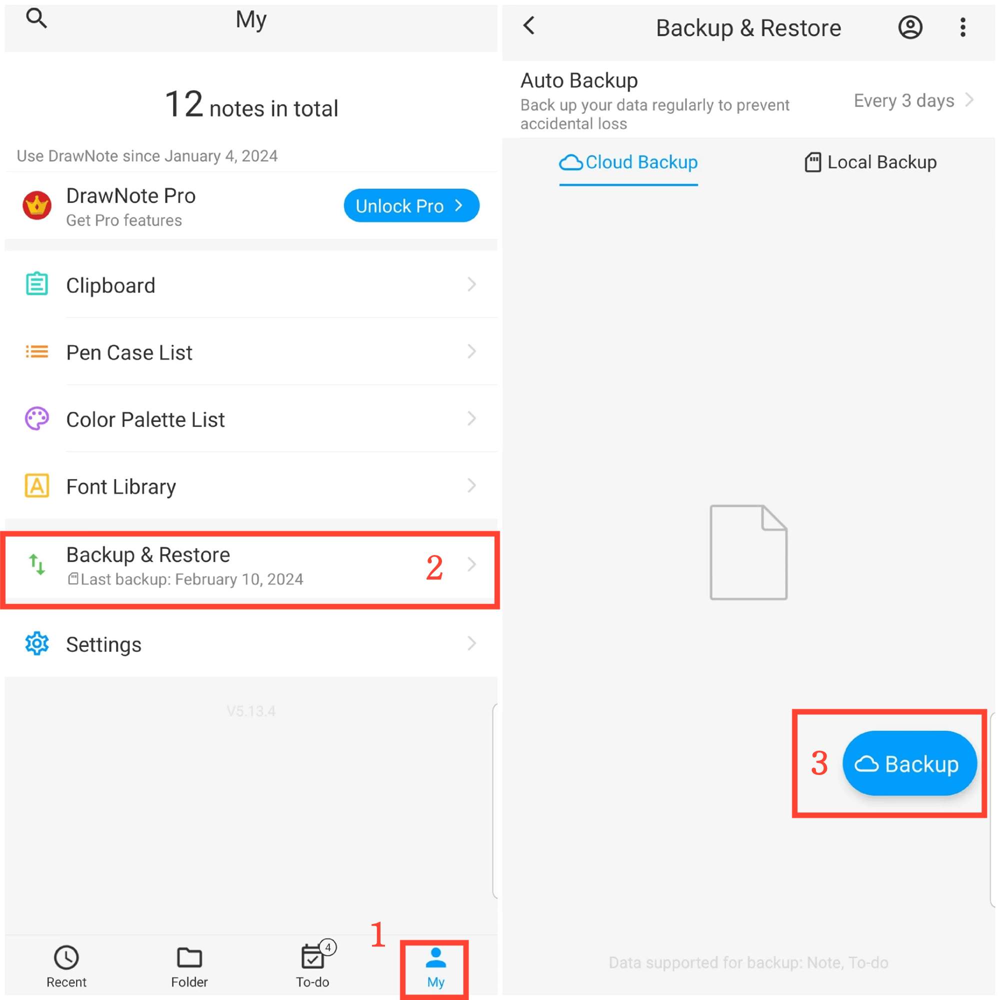

[Manual del usuario](/dragonnest/drawnote/manual/es) > [Copia de seguridad y recuperación de datos](/dragonnest/drawnote/manual/es/data_backup_and_recovery) >

Copia de seguridad de datos
---
#### Pasos

1. Toca "Mi" en la página principal.

2. Accede a la opción "Copia de seguridad y restauración".

3. Haz clic en "Copia de seguridad" para iniciar una copia de seguridad inmediata.

