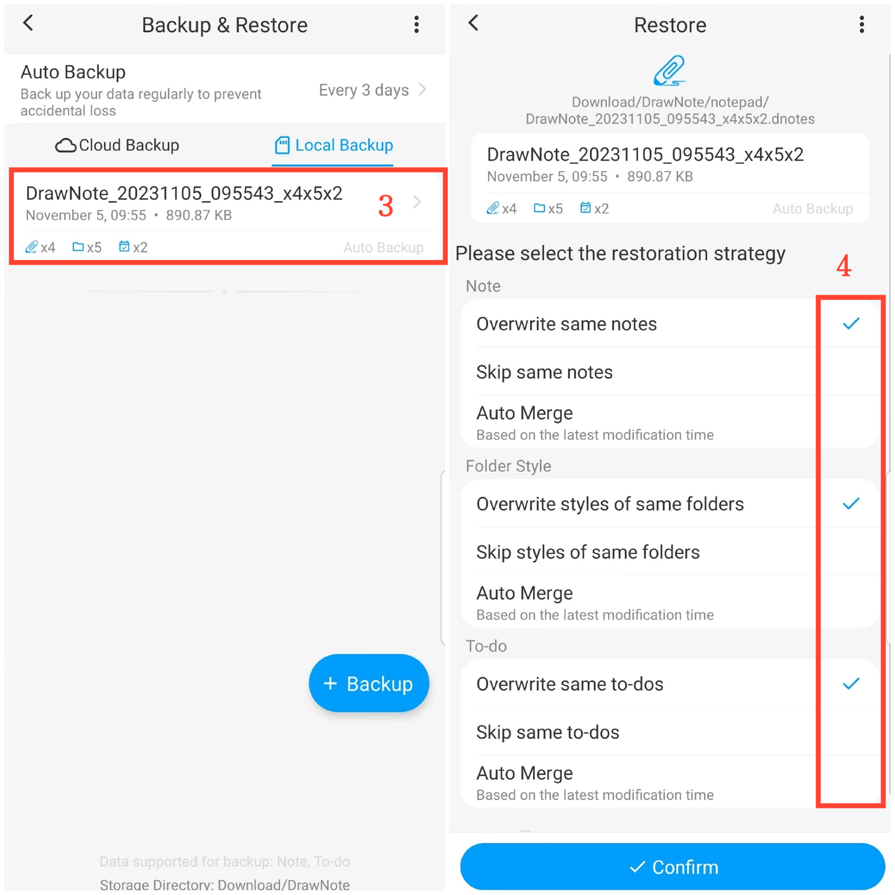

[Manual del usuario](/dragonnest/drawnote/manual/es) > [Copia de seguridad y recuperación de datos](/dragonnest/drawnote/manual/es/data_backup_and_recovery) >

Recuperación de datos
---
#### Pasos

1. Toca "Yo" en la página principal.

2. Accede a la opción "Copia de seguridad y restauración".

3. Haz clic en una entrada de archivo para seleccionar un archivo de copia de seguridad.

4. Marca las opciones apropiadas.

5. Haz clic en "Confirmar" para restaurar los datos.

#### Consejos
Al recuperar datos de copia de seguridad, hay tres estrategias para elegir:

- Sobrescribir las mismas notas: reemplaza las notas actuales con el contenido de la copia de seguridad.
- Omitir las mismas notas: conserva las notas actuales sin cambios cuando el contenido de la copia de seguridad es el mismo.
- Fusión automática: fusiona las notas de copia de seguridad y las existentes en función de la última hora de modificación.

Elige la estrategia apropiada según tus necesidades y realiza copias de seguridad regularmente para evitar la pérdida de datos.