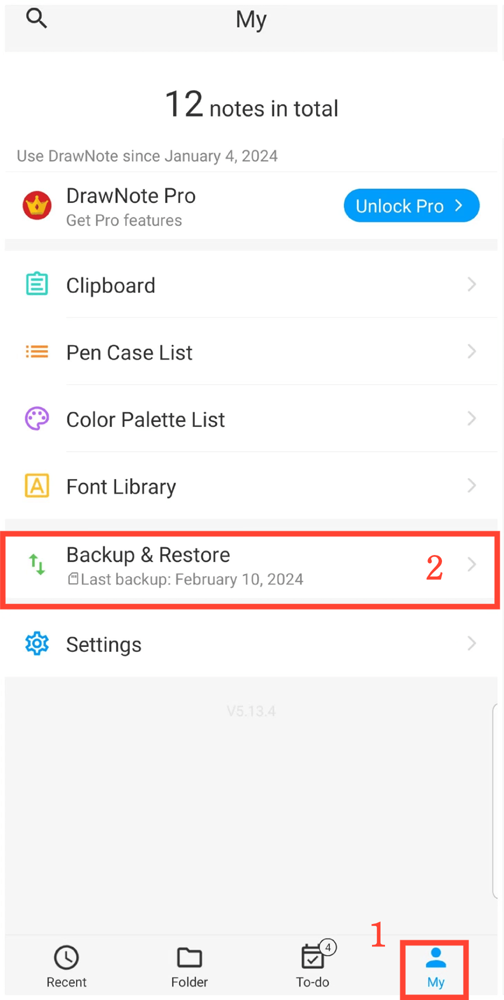

[Manual del usuario](/dragonnest/drawnote/manual/es) >

Copia de seguridad y recuperación de datos
---

Con la función de copia de seguridad y recuperación de datos, puedes proteger fácilmente la información crítica y evitar pérdidas inesperadas.
Puedes elegir entre "copia de seguridad en la nube" o "copia de seguridad local".
- [Copia de seguridad de datos](data_backup.md)

- [Copia de seguridad automática](automatic_backup.md)

- [Recuperación de datos](data_recovery.md)

- [Gestionar datos de copia de seguridad](manage_backup_data.md)

