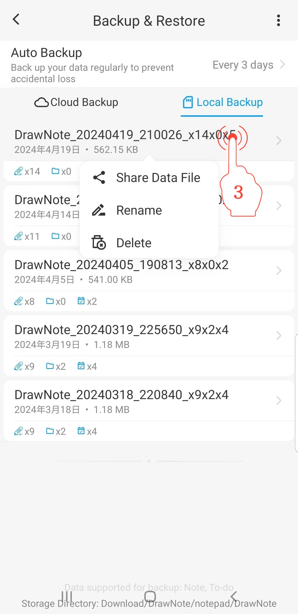

[Manual del usuario](/dragonnest/drawnote/manual/es) > [Copia de seguridad y recuperación de datos](/dragonnest/drawnote/manual/es/data_backup_and_recovery) >

Gestionar datos de copia de seguridad
---
#### Pasos

1. Toca "Yo" en la página principal.

2. Accede a la opción "Copia de seguridad y restauración".

3. Mantén pulsada una entrada de archivo para gestionar los elementos de recuperación de datos. Puedes realizar operaciones de compartir, cambiar nombre y eliminar.

