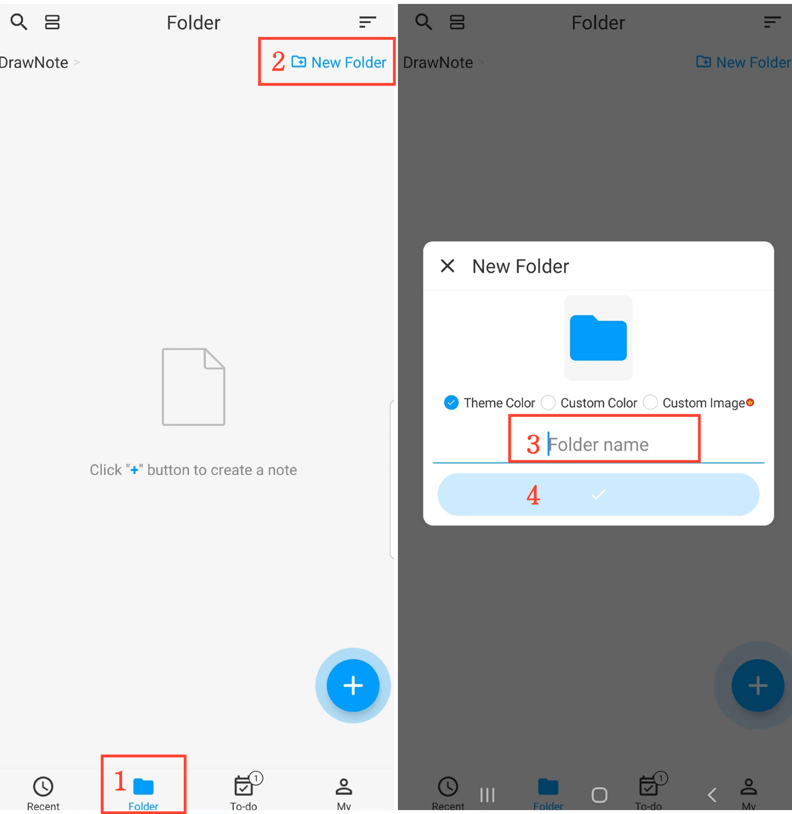

[Manual del usuario](/dragonnest/drawnote/manual/es) > [Carpeta](/dragonnest/drawnote/manual/es/folder) >

Crear nueva carpeta
---
#### Pasos

1. Toca "Carpeta" en la página principal.

2. Haz clic en el botón "Nueva carpeta" en la esquina superior derecha.

3. Ingresa el nombre de la carpeta.

4. Haz clic en el botón de confirmación.

#### Consejos
- Puedes elegir el color de la carpeta o personalizar la portada al crear o editar una carpeta.