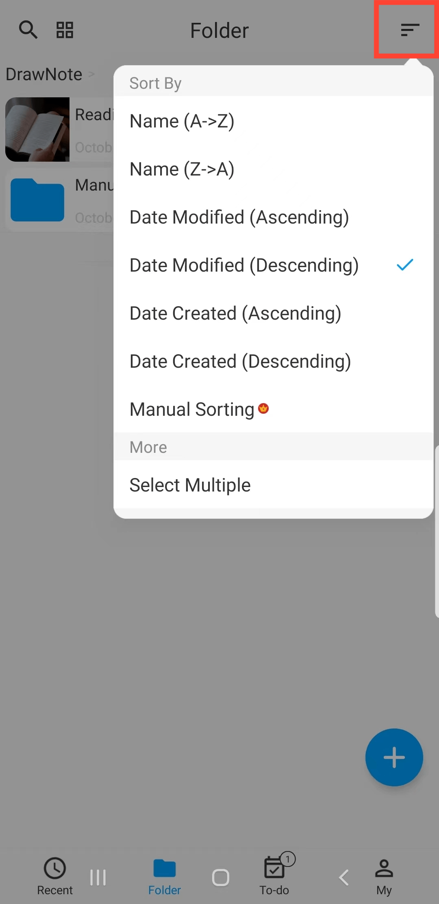

[Manual del usuario](/dragonnest/drawnote/manual/es) > [Carpeta](/dragonnest/drawnote/manual/es/folder) >

Ordenar carpetas
---
Existen múltiples formas de ordenar las carpetas. Puedes ordenarlas por Nombre, Fecha de modificación, Fecha de creación, y más, o puedes organizarlas manualmente.

#### Seleccionar un método de ordenación
En la página de "Carpeta", haz clic en el botón "Ordenar por" y elige tu método de ordenación preferido.

#### Ordenación manual
1. En la página de "Carpeta".

2. Haz clic en el botón "Ordenar".

3. Mantén pulsada y arrastra las carpetas hacia arriba y hacia abajo para ajustar su orden.

