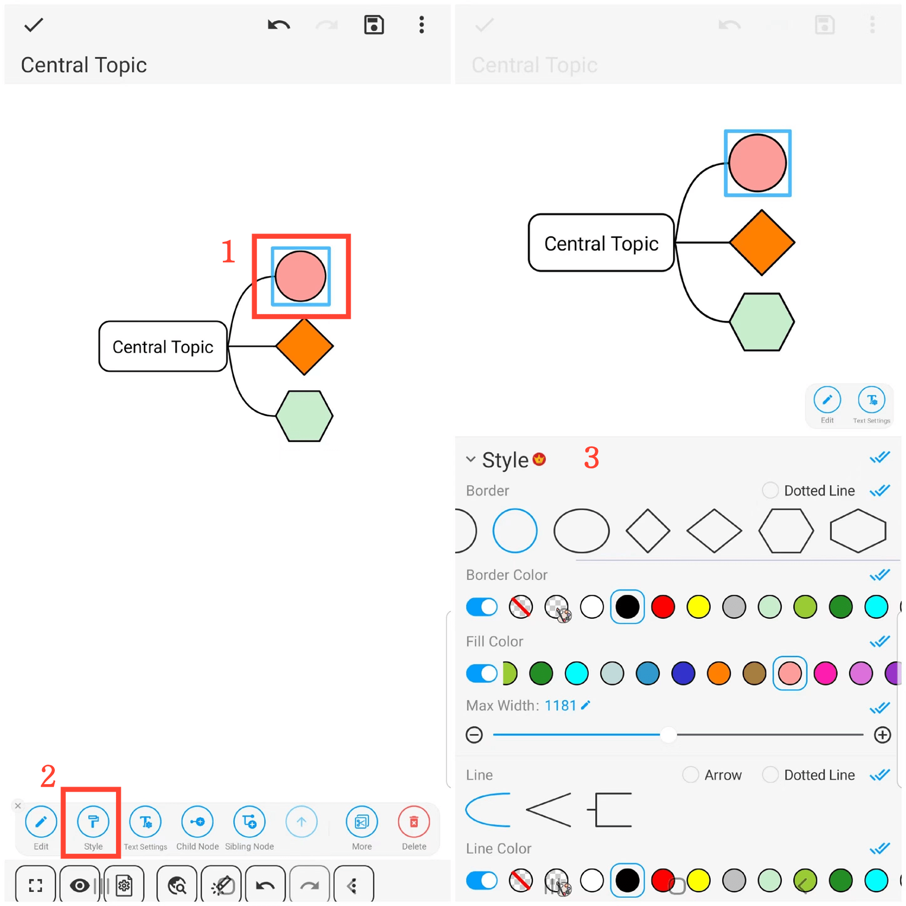

[Manual del usuario](/dragonnest/drawnote/manual/es) > [Mapa mental](/dragonnest/drawnote/manual/es/mind_mapping) >

Bordes y estilos de línea
---
#### Pasos

1. Haz clic en el marco del nodo que deseas configurar.

2. Haz clic en la pestaña "Estilo".

3. En la ventana emergente, elige las opciones de estilo deseadas, como forma del borde, color del borde, color de relleno, estilo de línea y color de línea.

#### Consejos
Haz clic en las dos marcas de verificación azules a la derecha. Para aplicar el estilo a subnodos, nodos hermanos o ambos.

