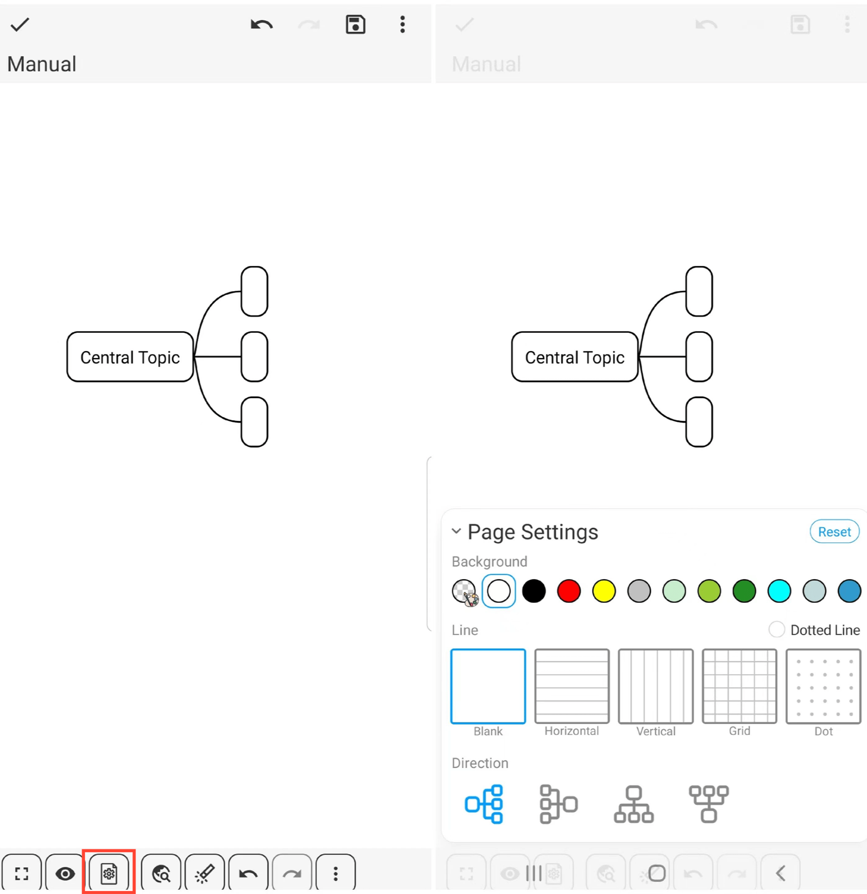

[Manual del usuario](/dragonnest/drawnote/manual/es) > [Mapeo mental](/dragonnest/drawnote/manual/es/mind_mapping) >

Configuración de página
---
#### Pasos

Haz clic en el icono de "Configuración de página" en la barra de herramientas inferior para abrir el menú de configuración de página, donde puedes personalizar el fondo de la página, el estilo del Mapeo mental y más.

