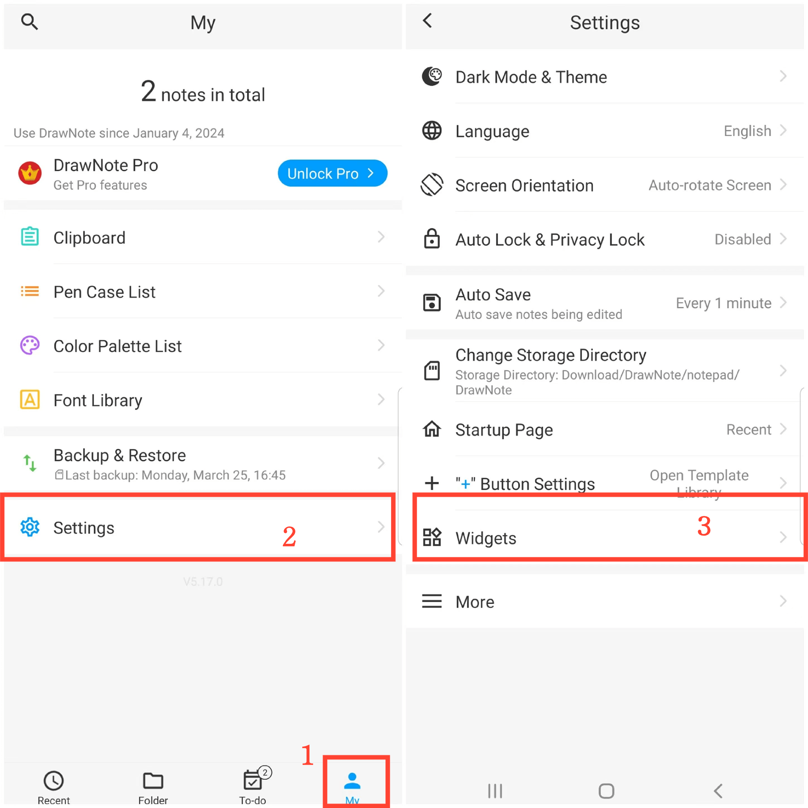

[Manual del Usuario](/dragonnest/drawnote/manual/es) > [Más](/dragonnest/drawnote/manual/es/more) >

Agregar Widget de Escritorio
---
Al agregar widgets de escritorio a la pantalla principal de su dispositivo, puede acceder fácil y rápidamente a las funciones de edición de notas sin abrir la aplicación.

### Pasos

1. Toque "Yo" en la pantalla principal.
2. Ingrese a "configuración".
3. Haga clic en "Widgets" y seleccione el tipo de widget que desea agregar.

#### Consejos
También puede acceder directamente a la configuración del widget en la pantalla de inicio de su dispositivo, encontrar la aplicación y luego agregar el widget de escritorio.