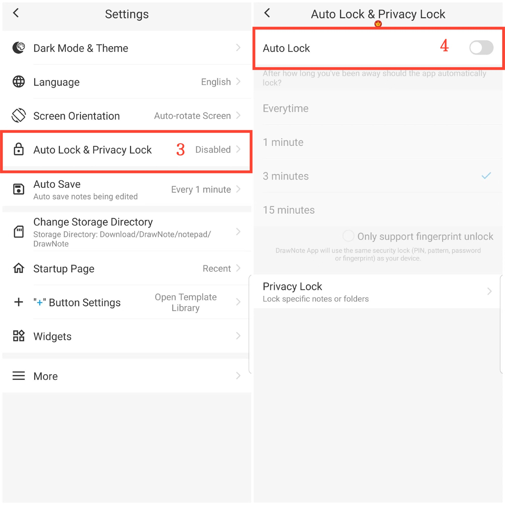

[Manual del Usuario](/dragonnest/drawnote/manual/es) > [Más](/dragonnest/drawnote/manual/es/more) >

Bloqueo Automático
---
El bloqueo automático se refiere a la aplicación bloqueándose automáticamente después de un período de inactividad. Esto mejora la privacidad y la seguridad de los datos, evitando el acceso no autorizado.

#### Pasos

1. Toque "Yo" en la página principal.

2. Acceda a configuración.

3. Haga clic en "Bloqueo Automático y Bloqueo de Privacidad".

4. Active el interruptor "Bloqueo Automático" y seleccione el tiempo de bloqueo automático.

