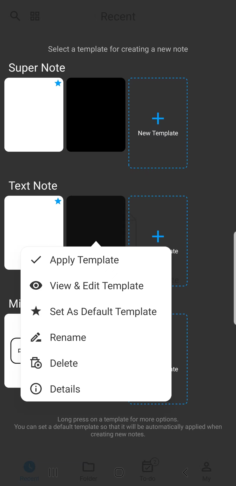

[Manual del Usuario](/dragonnest/drawnote/manual/es) > [Más](/dragonnest/drawnote/manual/es/more) >

Creación de Plantillas
---
Al crear plantillas, puede aplicar automáticamente la configuración de la plantilla al crear una nueva nota, como el color de fondo, el tamaño de fuente, el color de fuente y otras configuraciones comunes.

### Pasos

1. En la página de inicio de la aplicación, toque el icono "+" en la esquina inferior derecha.
2. Toque "Biblioteca de Plantillas".
3. Seleccione "Nueva Plantilla" después del tipo de nota deseado.
4. Ingrese a la página de edición de la plantilla para configurar las opciones, incluido el color de fondo, el tamaño de fuente, el color de fuente, etc., y guarde cuando haya terminado.

#### Consejos
Mantenga presionada la biblioteca de plantillas para acceder a más opciones, como ver y editar plantillas, establecer como plantilla predeterminada, etc.
