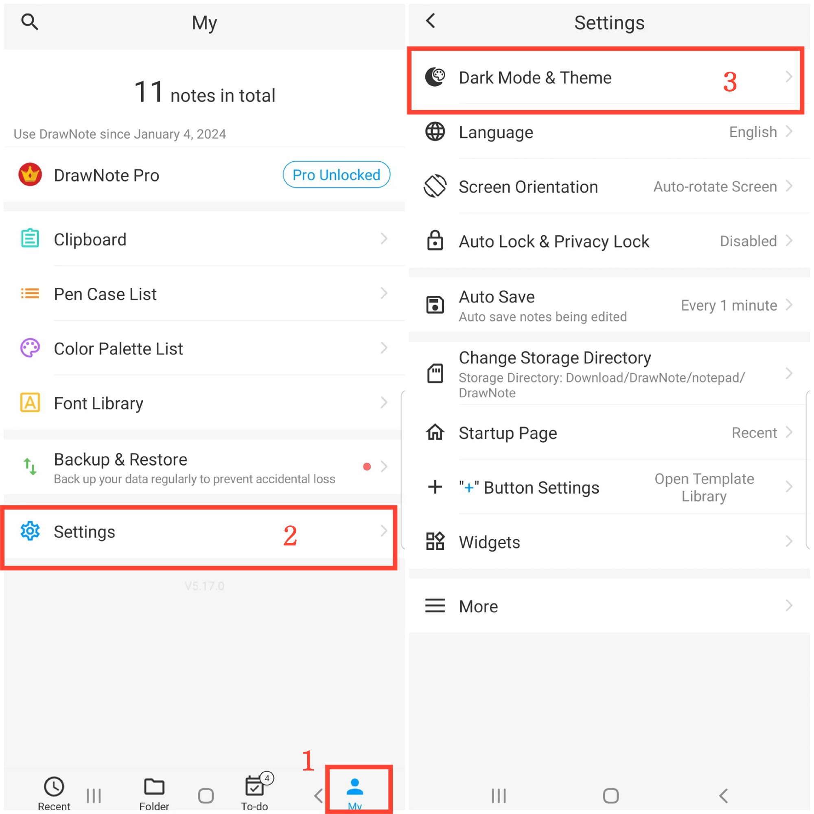
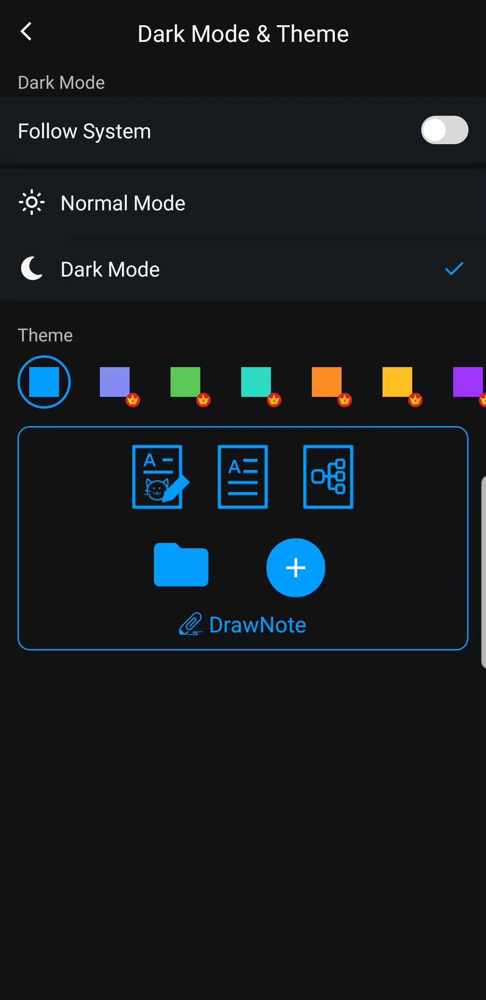

[Manual del Usuario](/dragonnest/drawnote/manual/es) > [Más](/dragonnest/drawnote/manual/es/more) >

Modo Oscuro y Cambio de Tema
---
El modo oscuro proporciona una experiencia de lectura más cómoda, ayudando a reducir la fatiga visual y proteger la salud visual. Esta función le permite cambiar fácilmente a un modo oscuro más cómodo y elegir colores de tema según sus preferencias personales.

### Pasos
1. Toque en "Yo" en la pantalla principal.
2. Vaya a Configuración.
3. Haga clic en "Modo oscuro y Tema".
4. Aquí, puede cambiar al modo oscuro y elegir diferentes colores de tema para personalizar la interfaz según sus preferencias.

