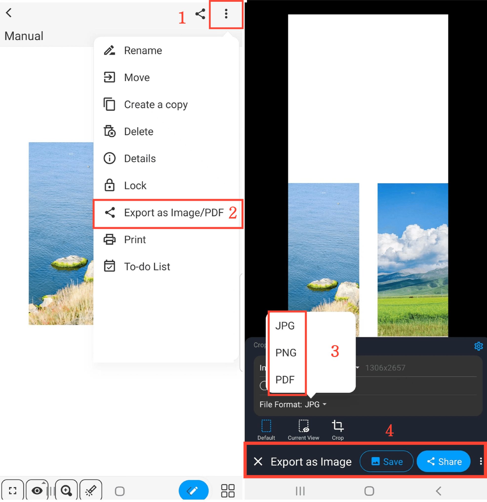

[Manual del Usuario](/dragonnest/drawnote/manual/es) > [Más](/dragonnest/drawnote/manual/es/more) >

Exportar/Compartir Notas
---
Existen dos métodos para exportar/compartir notas.

#### Método 1
1. En modo de lectura, haga clic en el icono "Compartir" en la esquina superior derecha del lienzo.

2. Elija el formato de archivo en el que desea exportar su nota.

3. Seleccione "Guardar" o "Compartir" y elija el método de compartir para completar la acción.

#### Método 2
1. En modo de lectura, haga clic en el icono de "⋮" más en la esquina superior derecha.

2. Seleccione "Exportar como Imagen/PDF".

3. Elija el formato de archivo en el que desea exportar su nota.

4. Haga clic en "Guardar" o "Compartir" y elija el método de compartir para completar la acción.

