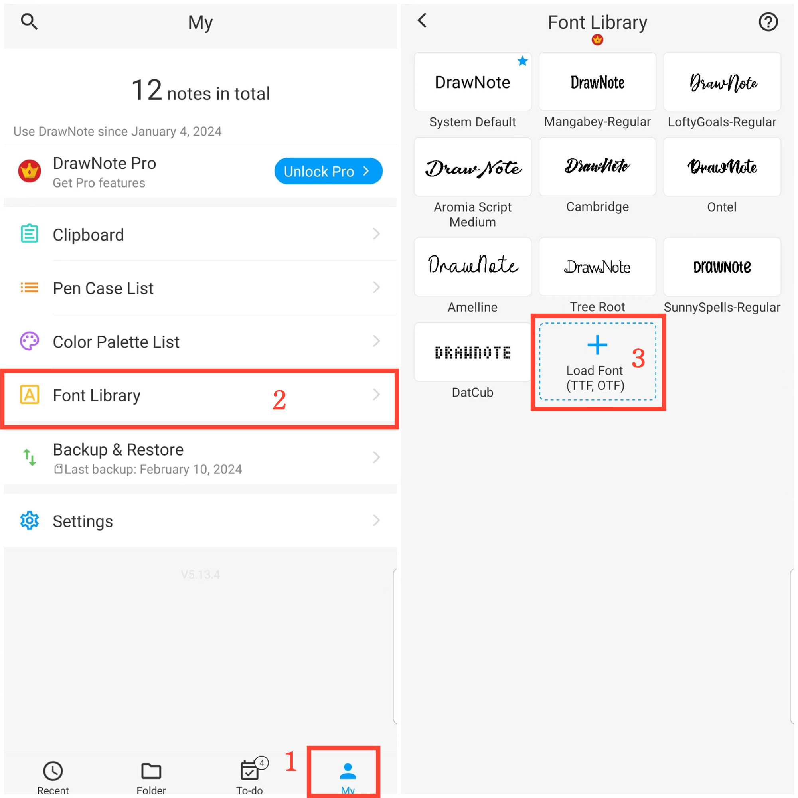

[Manual del Usuario](/dragonnest/drawnote/manual/es) > [Más](/dragonnest/drawnote/manual/es/more) >

Biblioteca de Fuentes
---
La biblioteca de fuentes puede guardar sus fuentes comúnmente utilizadas. Le permite elegir libremente el estilo de fuente apropiado en notas de texto o cuadros de texto.

#### Pasos

1. Toque "Yo" en la página principal.

2. Acceda a la biblioteca de fuentes.

3. Haga clic en "Cargar fuente" y seleccione un archivo de fuente para importar.

#### Consejos
Puede descargar las fuentes que desee desde este sitio web: https://www.fontspace.com/commercial-fonts