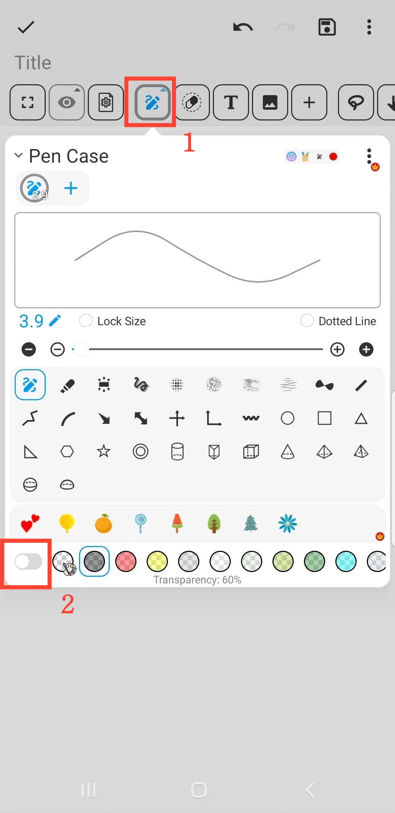

[Manual del Usuario](/dragonnest/drawnote/manual/es) > [Más](/dragonnest/drawnote/manual/es/more) >

Efecto de Marcador
---
El efecto de marcador puede ayudarlo a enfatizar información importante.

#### Pasos
1. En la página de Super Notas, haga clic en el botón "Estuche de bolígrafos".

2. En el menú emergente, haga clic en el botón inferior para cambiar la opacidad del color del pincel y lograr el efecto de marcador.

