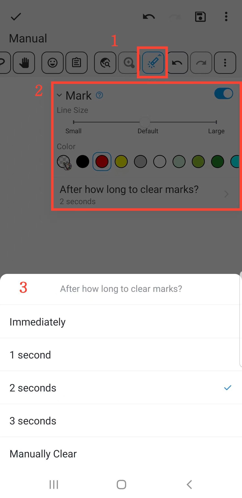

[Manual del Usuario](/dragonnest/drawnote/manual/es) > [Más](/dragonnest/drawnote/manual/es/more) >

Función de Marcado
---
La función de marcado le ayuda a resaltar puntos clave y atraer la atención, adecuada para enseñanza y presentaciones.

#### Pasos

1. Haga clic en el botón "Marcar" en la barra de herramientas para realizar demostraciones de marcado en el lienzo.

2. Puede ajustar el tamaño de línea y los colores.

3. Además, puede establecer un tiempo de borrado automático para los marcados o borrarlos manualmente.

#### Consejos
La función de marcado es para demostraciones, y los marcados se eliminarán cuando salga del lienzo. Si necesita enfatizar contenido y guardarlo permanentemente, puede ingresar al modo de edición y usar la herramienta de lápiz para marcar.