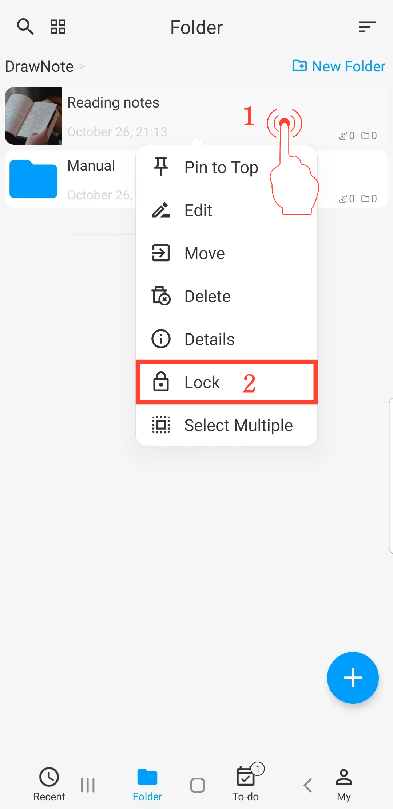

[Manual del Usuario](/dragonnest/drawnote/manual/es) > [Más](/dragonnest/drawnote/manual/es/more) >

Bloqueo de Privacidad
---
Con el Bloqueo de Privacidad, puede bloquear notas y carpetas específicas.

#### Pasos

1. Mantenga presionada la nota o carpeta que desea bloquear/desbloquear.

2. En el menú emergente, haga clic en "Bloquear"/"Desbloquear" para bloquear o desbloquear la nota o carpeta.

#### Consejos
- El contenido bloqueado no se puede buscar directamente.

- En la interfaz de "Yo" y "Bloqueo Automático y Bloqueo de Privacidad", puede configurar el Bloqueo de Privacidad con desbloqueo mediante huella digital o contraseña.

- El Bloqueo de Privacidad es un mecanismo de bloqueo temporal local. Esto significa que cuando bloquea notas, las respalda y luego restaura esas notas en otro dispositivo, no necesita desbloquearlas nuevamente para ver su contenido.