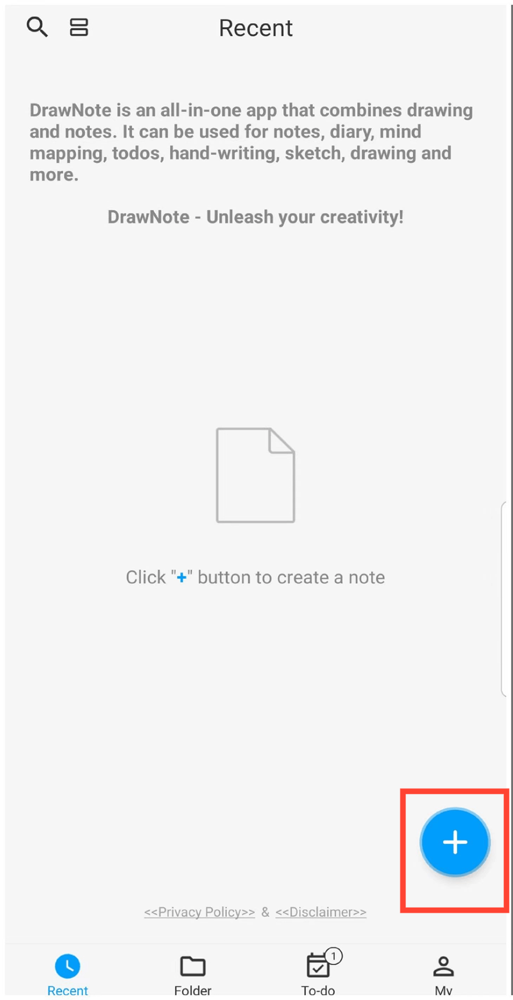

[Manual del Usuario](/dragonnest/drawnote/manual/es) >

Crear una Nueva Nota
---
DrawNote ofrece una variedad de tipos de notas flexibles para satisfacer diferentes escenarios de usuario, incluyendo Super Nota, Nota de Texto y Mapa Mental.

- Super Nota: Una nota integral que combina escritura a mano, dibujo, texto, imágenes, grabaciones de audio, tablas y mapas mentales. Te permite expresar completamente tu creatividad y talento artístico en un lienzo flexible.

- Nota de Texto: Centrada en la grabación de texto y compatible con ajustes de texto enriquecido así como inserciones de imágenes, haciendo que tus notas sean más diversas y visuales.

- Mapa Mental: Te ayuda a capturar rápidamente ideas y organizar conocimientos, presentando conceptos complejos en una estructura gráfica clara.

#### Pasos

En la página de inicio de la aplicación, toca el icono "+" en la esquina inferior derecha. Luego, selecciona el tipo de nota que deseas crear para comenzar tu nota.

#### Consejos

- Cuando tocas el botón "+" en la sección 'Carpeta' para crear una nueva nota, la nota se categorizará automáticamente bajo la carpeta actual.

- También puedes utilizar los accesos directos en la parte superior del menú para acceder rápidamente a diversas interfaces de creación dentro de Super Nota.

